# Human-Controlled Todo Creation Orchestrator

Multi-agent system creating validated todo lists via step-by-step execution, learning, and synthesis.

**Features**: 🎯 Human-in-loop • 🔄 Learning-based • 📊 Validation-driven • 🤖 Multi-agent • 📝 Markdown-based

---

## ⚡ Quick Reference

| Phase | Agent | Output | Human Decision |
|-------|-------|--------|---------------|
| **0** | Variable Extraction | `variables.json` | Use/Extract new |
| **1** | Planning → Reader | `plan.md` → JSON | Use/Create/Update |
| **2** | Execute → Validate → Learn | Step results | Approve/Re-execute/Stop |
| **3** | Writer → Critique | `todo_final.md` | Final approval |

**Retry Limits**: Execution (3), Plan (20), Critique (3)  
**Progress**: Auto-saved in `steps_done.json`

---

## 🏗️ Architecture

### Main Workflow

```
┌──────────────────────────────────────────────┐
│  Phase 0: Variables                         │
│  ┌──────────────────┐                       │
│  │ Variable Agent   │ → variables.json      │
│  └────────┬─────────┘                       │
│           │ 👤 Verify                        │
└───────────┼──────────────────────────────────┘
            │
┌───────────▼──────────────────────────────────┐
│  Phase 1: Planning                           │
│  ┌──────────────────┐                       │
│  │ Planning Agent   │ → plan.md             │
│  └────────┬─────────┘                       │
│           │ 👤 3 Options:                   │
│           │   • Use Existing                │
│           │   • Create New                  │
│           │   • Update Existing             │
│           │                                │
│  ┌────────▼─────────┐                       │
│  │ Plan Reader       │ → JSON               │
│  └────────┬─────────┘                       │
│           │ 👤 Approve (max 20 rev)          │
└───────────┼──────────────────────────────────┘
            │
┌───────────▼──────────────────────────────────┐
│  Phase 2: Execution (per step)               │
│  ┌──────────────────┐                       │
│  │ Execute (x3)      │                       │
│  │ → Validate        │                       │
│  │ → Learn           │                       │
│  └────────┬─────────┘                       │
│           │ 👤 Approve/Re-execute/Stop      │
└───────────┼──────────────────────────────────┘
            │
┌───────────▼──────────────────────────────────┐
│  Phase 3: Synthesis                          │
│  ┌──────────────────┐                       │
│  │ Writer + Critique│ → todo_final.md      │
│  └────────┬─────────┘                       │
│           │ 👤 Review                        │
└───────────┴──────────────────────────────────┘
```

### Step Execution Loop - Detailed Flowchart

```mermaid
flowchart TD
    Start([Start Execution Phase]) --> CheckProgress{Check Progress}
    
    CheckProgress -->|Step Completed| Skip[⏭️ Skip Step]
    CheckProgress -->|Step Not Done| Execute[📋 Execute Step]
    
    Skip --> NextStep{More Steps?}
    
    Execute --> RetryLoop[🔄 Retry Loop<br/>Attempt 1-3]
    
    RetryLoop --> CreateAgent[🤖 Create Execution Agent]
    CreateAgent --> RunExecute[⚡ Execute Step with MCP Tools]
    
    RunExecute -->|Error| CheckRetry1{Retry < 3?}
    CheckRetry1 -->|Yes| RetryLoop
    CheckRetry1 -->|No| LogError[❌ Log Error<br/>Break Retry Loop]
    
    RunExecute -->|Success| CreateValid[🔍 Create Validation Agent]
    
    CreateValid -->|Error| CheckRetry2{Retry < 3?}
    CheckRetry2 -->|Yes| RetryLoop
    CheckRetry2 -->|No| LogError
    
    CreateValid -->|Success| Validate[✅ Validate Step]
    
    Validate -->|Error| CheckRetry3{Retry < 3?}
    CheckRetry3 -->|Yes| RetryLoop
    CheckRetry3 -->|No| LogError
    
    Validate -->|Success| CheckSuccess{Success<br/>Criteria Met?}
    
    CheckSuccess -->|Yes| SuccessPath[✅ PASS]
    CheckSuccess -->|No| FailurePath[❌ FAIL]
    
    SuccessPath --> CheckFast{Fast Execute<br/>Mode?}
    FailurePath --> CheckRetry4{Retry < 3?}
    
    CheckRetry4 -->|Yes| StoreFeedback[💾 Store Validation Feedback]
    StoreFeedback --> RetryLoop
    
    CheckRetry4 -->|No| LogFailure[❌ Log Failure<br/>Break Retry Loop]
    
    CheckFast -->|Yes| AutoApprove[⚡ Auto-Approve]
    CheckFast -->|No| HumanFeedback[👤 Request Human Feedback]
    
    LogError --> HumanFeedback
    LogFailure --> HumanFeedback
    
    SuccessPath --> SuccessLearn[🧠 Success Learning Agent]
    SuccessLearn --> UpdateSuccess[📝 Update plan.md<br/>with Success Patterns]
    
    FailurePath --> FailureLearn[🧠 Failure Learning Agent]
    FailureLearn --> RootCause[🔍 Root Cause Analysis]
    RootCause --> RefineTask[📝 Refine Task Description]
    RefineTask --> UpdateFailure[📝 Update plan.md<br/>with Failure Patterns]
    
    UpdateSuccess --> HumanFeedback
    UpdateFailure --> HumanFeedback
    
    HumanFeedback --> HumanDecision{Human Decision}
    
    HumanDecision -->|Approve| ApproveStep[✅ Approve Step]
    HumanDecision -->|Re-execute| AddFeedback[💬 Add Feedback to History]
    HumanDecision -->|Stop| EndWorkflow[🛑 Stop All Steps]
    
    AddFeedback --> RetryLoop
    
    ApproveStep --> SaveProgress[💾 Save Progress<br/>steps_done.json]
    SaveProgress --> MarkComplete[✅ Mark Step Complete]
    
    AutoApprove --> SaveProgress
    
    MarkComplete --> NextStep
    
    NextStep -->|Yes| Execute
    NextStep -->|No| WriterPhase[📝 Writer Phase]
    
    EndWorkflow --> WriterPhase
    WriterPhase --> End([End Execution])
    
    style Start fill:#e1f5ff
    style End fill:#fff4e1
    style Execute fill:#ffe1f5
    style RetryLoop fill:#e1ffe1
    style SuccessPath fill:#90EE90
    style FailurePath fill:#FFB6C1
    style HumanFeedback fill:#FFE4B5
    style ApproveStep fill:#98FB98
    style EndWorkflow fill:#FF6347
    style WriterPhase fill:#DDA0DD
```



**Key Details**:
- **Retry Loop**: Max 3 attempts with validation feedback
- **Error Handling**: Proper break on max attempts (prevents infinite loops)
- **Fast Mode**: Auto-approve completed steps
- **Learning**: Success/Failure analysis after validation
- **Progress**: Auto-saved to `steps_done.json` after approval

### Decision Points Flowchart

```mermaid
flowchart TD
    Start([Workflow Start]) --> CheckVars{variables.json<br/>Exists?}
    
    CheckVars -->|Yes| AskUseVars{Use Existing<br/>Variables?}
    CheckVars -->|No| ExtractNew[📝 Extract New Variables]
    
    AskUseVars -->|Yes| UseVars[✅ Use Existing Variables]
    AskUseVars -->|No| DeleteVars[🗑️ Delete variables.json]
    DeleteVars --> ExtractNew
    
    ExtractNew --> VerifyVars[👤 Verify Variables]
    UseVars --> CheckPlan{plan.md<br/>Exists?}
    VerifyVars --> CheckPlan
    
    CheckPlan -->|Yes| PlanOptions[👤 3 Options]
    CheckPlan -->|No| CreatePlan[📋 Create New Plan]
    
    PlanOptions --> Option1[1️⃣ Use Existing]
    PlanOptions --> Option2[2️⃣ Create New]
    PlanOptions --> Option3[3️⃣ Update Existing]
    
    Option1 --> PlanReader[📖 Plan Reader → JSON]
    Option2 --> CleanupAll[🗑️ Delete:<br/>• plan.md<br/>• validation/<br/>• learnings/<br/>• execution/]
    Option3 --> UpdateFeedback[💬 Ask: What to Update?]
    
    CleanupAll --> CreatePlan
    UpdateFeedback --> CreatePlanUpdate[📋 Create Updated Plan<br/>Keep Artifacts]
    
    CreatePlan --> PlanReader
    CreatePlanUpdate --> PlanReader
    
    PlanReader --> PlanApproval{Plan<br/>Approved?<br/>max 20 rev}
    
    PlanApproval -->|No| RevisePlan[📝 Revise Plan]
    RevisePlan --> PlanReader
    
    PlanApproval -->|Yes| CheckProgress{Check<br/>Progress}
    
    CheckProgress -->|All Done| WriterPhase[📝 Writer Phase]
    CheckProgress -->|Resume| ResumeOptions[👤 Resume Options]
    CheckProgress -->|Start Fresh| ExecuteStep[⚡ Execute Step]
    
    ResumeOptions --> Resume[▶️ Resume]
    ResumeOptions --> Fresh[🔄 Start Fresh]
    ResumeOptions --> Fast[⚡ Fast Execute]
    
    Resume --> ExecuteStep
    Fresh --> ExecuteStep
    Fast --> ExecuteStep
    
    ExecuteStep --> Validate{Validation<br/>PASS?}
    
    Validate -->|Yes| SuccessLearn[🧠 Success Learning]
    Validate -->|No| FailureLearn[🧠 Failure Learning]
    
    SuccessLearn --> StepApproval{Step<br/>Approved?}
    FailureLearn --> Retry{Retry<br/>< 3?}
    
    Retry -->|Yes| ExecuteStep
    Retry -->|No| StepApproval
    
    StepApproval -->|Approve| MarkDone[✅ Mark Complete<br/>Save Progress]
    StepApproval -->|Re-execute| AddFeedback[💬 Add Feedback]
    StepApproval -->|Stop| EndWorkflow[🛑 Stop Workflow]
    
    AddFeedback --> ExecuteStep
    
    MarkDone --> MoreSteps{More<br/>Steps?}
    MoreSteps -->|Yes| ExecuteStep
    MoreSteps -->|No| WriterPhase
    
    WriterPhase --> Critique{Critique<br/>Pass?<br/>max 3 rev}
    Critique -->|No| ReviseTodo[📝 Revise Todo]
    ReviseTodo --> WriterPhase
    
    Critique -->|Yes| FinalReview[👤 Final Review]
    EndWorkflow --> FinalReview
    
    FinalReview -->|Approve| Complete([✅ Complete])
    FinalReview -->|Revise| WriterPhase
    
    style Start fill:#e1f5ff
    style Complete fill:#90EE90
    style CheckVars fill:#FFE4B5
    style CheckPlan fill:#FFE4B5
    style PlanOptions fill:#DDA0DD
    style Validate fill:#FFE4B5
    style StepApproval fill:#FFE4B5
    style Critique fill:#FFE4B5
    style ExtractNew fill:#ffe1f5
    style CreatePlan fill:#ffe1f5
    style ExecuteStep fill:#ffe1f5
    style WriterPhase fill:#DDA0DD
    style EndWorkflow fill:#FF6347
    style CleanupAll fill:#FFB6C1
```



---

## 🤖 Agents Overview

| # | Agent | Purpose | Key Files |
|---|-------|---------|-----------|
| 1 | **Variable Extraction** | Extract & verify `{{VARS}}` | `variables.json` |
| 2 | **Planning** | Create execution plan | `plan.md` |
| 3 | **Plan Reader** | Convert markdown → JSON | - |
| 4 | **Execution** | Execute step (retry x3) | Context outputs |
| 5 | **Validation** | Verify success criteria | `validation/*.md` |
| 6 | **Success Learning** | Capture what worked | `learnings/*.md` |
| 7 | **Failure Learning** | Root cause analysis | `learnings/*.md` |
| 8 | **Writer** | Synthesize final todo | `todo_final.md` |
| 9 | **Critique** | Quality validation (x3) | - |

---

## 📁 Workspace Structure

```
workspace/
├── todo_creation_human/
│   ├── variables/variables.json          # Phase 0 output
│   ├── planning/plan.md                  # Phase 1 output
│   ├── validation/step_X_*.md            # Per-step validation
│   ├── learnings/                        # Success/failure patterns
│   ├── execution/step_X_*.md            # Context outputs
│   └── steps_done.json                   # Progress tracking
│
└── todo_final.md                         # Phase 3 output
```

---

## 🔄 Phase Details

### Phase 0: Variable Extraction
**Flow**: Extract → Verify → Use  
**Decision**: Use existing or extract new?  
**Cleanup**: Delete `variables.json` if extracting new

### Phase 1: Planning
**Flow**: Create → Human choice → Reader → Approve  
**Decisions**:
- **Use Existing**: Continue with current `plan.md`
- **Create New**: Delete old plan + artifacts → Create fresh
- **Update Existing**: Keep artifacts → Create updated plan → Ask what to update  
**Iterations**: Up to 20 plan revisions

### Phase 2: Execution (Per Step)
**Flow**: Execute → Validate → Learn → Human feedback  
**Retry Logic**: 
- Max 3 attempts per step
- Uses validation feedback for retries
- Proper break on max attempts (no infinite loops)
**Learning**:
- **PASS** → Success Learning (capture patterns)
- **FAIL** → Failure Learning (root cause + retry guidance)
**Human Options**: Approve / Re-execute / Stop

### Phase 3: Synthesis
**Flow**: Writer → Critique (x3) → Human review  
**Output**: `todo_final.md` with success/failure patterns

---

## 🔑 Key Features

### Progress Tracking
- **Auto-save**: `steps_done.json` after each step
- **Resumable**: Continue from last completed step
- **Resume Options**: Resume / Start fresh / Fast execute
- **Fast Mode**: Auto-approve completed steps

### Retry & Error Handling
- **Auto-retry**: 3 attempts with validation feedback
- **Smart break**: Exits retry loop after max attempts
- **Error recovery**: Continues to human feedback on failure

### Human Control Points
1. **Variables**: Use existing or extract new?
2. **Plan**: Use / Create / Update existing?
3. **Plan Approval**: Approve or provide feedback (max 20 rev)
4. **Step Approval**: Approve / Re-execute / Stop
5. **Final Review**: Approve `todo_final.md`

### Learning System
- **Success Patterns**: Tool recommendations, working approaches
- **Failure Patterns**: What to avoid, root causes
- **Plan Updates**: Continuously improved with learnings

### Cleanup
- **Create New Plan**: Deletes `plan.md` + `validation/` + `learnings/` + `execution/`
- **Update Plan**: Preserves artifacts, only updates `plan.md`
- **New Variables**: Deletes `variables.json` before extraction

---

## 📊 Data Flow

```
Objective
  ↓
Variables → variables.json
  ↓
Planning → plan.md → JSON
  ↓
For Each Step:
  Execute → Validate → Learn → Feedback
  ↓
Writer → todo_final.md
```

---

## 🎯 Example

**Objective**: "Extract database URLs from config files"

| Phase | Action | Result |
|-------|--------|--------|
| **0** | Extract variables | `{{CONFIG_PATH}}` |
| **1** | Create plan | 2 steps: Read → Extract |
| **2.1** | Execute step 1 | Read `config/database.json` |
| **2.2** | Validate | ✅ PASS |
| **2.3** | Success Learning | Pattern: "Use `fileserver.read_file`" |
| **3** | Writer | `todo_final.md` with patterns |

---

## 🛠️ Configuration

| Setting | Value | Location |
|---------|-------|----------|
| Retry Limit | 3 attempts | Per step |
| Plan Revisions | 20 max | Phase 1 |
| Critique Revisions | 3 max | Phase 3 |
| Progress File | Auto-saved | `steps_done.json` |

---

## 📚 File Formats

### plan.md
```markdown
# Plan: [Objective]

## Steps
### Step 1: [Title]
- **Description**: [Details]
- **Success Criteria**: [Verification]
- **Context Dependencies**: [Files]
- **Context Output**: [Output file]
- **Success Patterns**: [What worked]
- **Failure Patterns**: [What to avoid]
```

### steps_done.json
```json
{
  "completed_step_indices": [0, 1],
  "total_steps": 5,
  "last_updated": "2025-01-27T12:00:00Z"
}
```

---

## 🔍 Troubleshooting

| Issue | Check | Solution |
|-------|-------|----------|
| Step fails | `validation/step_X_*.md` | Failure learning provides retry guidance |
| Missing context | `plan.md` dependencies | Update context dependencies |
| Wrong tools | `learnings/*.md` | Learning agents update plan with correct tools |
| Infinite loop | Code retry logic | Fixed: proper break/continue |
| Progress lost | `steps_done.json` | Auto-saved after each step |

**Debug Files**:
- `planning/plan.md` - Current plan with learnings
- `validation/*.md` - Execution history & validation
- `learnings/*.md` - Accumulated patterns
- `steps_done.json` - Progress tracking

---

## 📖 Usage

```bash
./orchestrator workflow \
  --objective "Build CI/CD pipeline" \
  --workspace "./workspace"

# Human decisions:
# 1. Variables: Use/Extract new?
# 2. Plan: Use/Create/Update?
# 3. Plan approval: Approve/Revise?
# 4. Each step: Approve/Re-execute/Stop?
# 5. Final todo: Approve?
```

---

**Part of the MCP Agent project**
