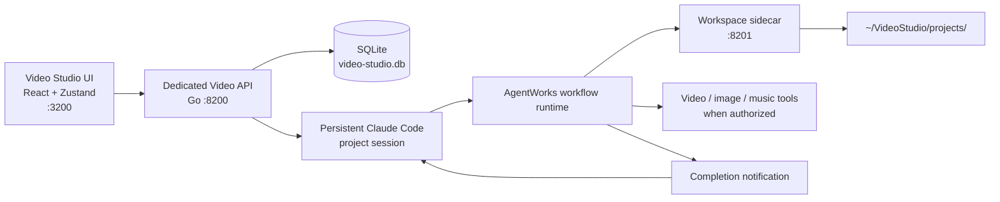

# Video Studio — Handover

**Last updated:** 2026-08-04  
**Repository:** `/Users/mipl/ai-work/mcp-agent-builder-video`  
**Local product URL:** `http://127.0.0.1:3200`  
**Local login:** `manish` / `12345`  
**Status:** chat, project storage, workflow orchestration, and planning stages work. A full cinematic video run currently fails before any media is generated.

## Product intent

Video Studio is a separate, local-first, chat-driven product for making videos. It reuses AgentWorks workflow execution and Claude Code, but hides framework and provider details from users.

- One continuous Claude Code session per project, resumed across chat turns.
- One large local workspace with many projects.
- A project owns uploaded assets, workflow artifacts, generated videos, and chat history.
- Projects are private today; the schema supports shared projects later.
- The only user-facing production workflow for now is **Cinematic video**.
- The user should see friendly progress, not internal tools, provider names, keys, locks, knowledge bases, or AgentWorks terminology.
- Local-only for now. AWS, Google sign-in, Slack, WhatsApp, GWS, publishing, and collaboration UX are deferred.

## OpenMontage is an important reference

The local reference clone is at `/Users/mipl/ai-work/OpenMontage`. It is useful because it demonstrates an agentic video-production system with explicit pipelines, provider/tool selection, generation, composition, and multi-point QA.

Use it as a **product and architecture reference**, not as code to copy. OpenMontage is licensed under **AGPLv3**; do not transplant its code into Video Studio without an explicit licensing decision.

What Video Studio should learn from it:

- A cinematic pipeline needs a concrete production contract: required inputs, approved generation prompts, asset paths, composition output, and QA evidence—not just a sequence of planning documents.
- Generation should be explicit and auditable: selected provider/model, prompt, cost, output path, retries, and quality result per asset.
- QA must be first-class: decode/ffprobe checks, frame sampling, audio/loudness checks, subtitle/caption checks, and a clear delivery verdict.
- Approval belongs before expensive generation. A future Studio workflow can expose a scene-by-scene storyboard/contact-sheet gate in the user-friendly UI while retaining the chat-first experience.
- A project dashboard should eventually show a live production timeline/library derived from workflow artifacts. This complements the current Videos, Assets, and Workflow tabs.

What stays different in Video Studio:

- Reuse AgentWorks' `execute_step`, `run_full_workflow`, notification, project session, secret manager, and local workspace infrastructure instead of adopting a second orchestration system.
- Keep one user-facing workflow, **Cinematic video**, rather than exposing OpenMontage-style pipeline selection in the initial product.
- Keep the custom Video Studio UI and its project-based chat as the primary user experience.

High-value OpenMontage files to study before implementing the next iteration:

- `pipeline_defs/cinematic.yaml` — cinematic pipeline contract
- `skills/creative/cinematic.md` — creative-stage guidance
- `schemas/pipelines/pipeline_manifest.schema.json` — manifest shape and validation ideas
- `remotion-composer/src/CinematicRenderer.tsx` — composition approach to evaluate, not copy
- `tests/tools/test_grok_video_quality_score.py` and `tests/contracts/` — QA and pipeline-contract test ideas

## Architecture



### Main implementation locations

| Area | Location |
|---|---|
| Product backend | `agent_go/internal/videoproduct/` |
| Dedicated server entry point | `agent_go/cmd/video-server/` |
| Video Studio frontend | `frontend/video-app/` |
| Zustand state and streaming events | `frontend/video-app/src/store.ts` |
| Chat/UI/tool activity rendering | `frontend/video-app/src/VideoApp.tsx` |
| Cinematic workflow definition and bridge | `agent_go/internal/videoproduct/workflow.go` |
| Project chat agent/system prompt | `agent_go/internal/videoproduct/agent.go` |
| Auto-notification resume handler | `agent_go/internal/videoproduct/server.go` |
| Local launcher | `scripts/run-video-studio.sh` |

### How we use OpenMontage (decided 2026-08-04)

OpenMontage (`/Users/mipl/ai-work/OpenMontage`) already solves the problem Video Studio is growing into: many pipelines, per-stage agents, approval gates, and a choice of render runtimes. **We port its concepts and keep our own files** — we do not depend on the OpenMontage repo at runtime, and we do not shell out to it. Video Studio stays a Go/React product; OpenMontage is Python with its own tool registry, so reuse is at the level of structure and prompt content, not code.

**Pipeline == workflow.** The two words mean the same thing; OpenMontage calls them pipelines, Video Studio calls them workflows.

What we take from it:

| OpenMontage concept | Where it lives there | What Video Studio does with it |
|---|---|---|
| Pipelines as data | `pipeline_defs/*.yaml` (`cinematic`, `animated-explainer`, `documentary-montage`, `screen-demo`, `talking-head`, …) | Replace hardcoded `cinematicSteps`/`CINEMATIC_PIPELINE` with a pipeline registry so new workflows are data, not code |
| Per-stage director skill | `skills/pipelines/<pipeline>/<role>-director.md` | One skill per stage agent |
| Shared skills | `skills/meta/*`, `skills/core/*` | Reused by every pipeline — this is where reuse actually happens |
| `checkpoint_required` / `human_approval_default` | per stage in the YAML | The approval gate before any paid generation (our Assets P0) |
| `tools_available` / `required_tools` | per stage | Stop giving every stage the same tools (our P2: stages probing disabled facilities) |
| `success_criteria` e.g. "All file paths resolve to existing files" | per stage | Makes "wrote a manifest but generated nothing" a stage failure |
| `budget_default_usd` + itemized cost estimate at proposal | pipeline + proposal stage | Cost control before spend |
| `render_runtime` locked at proposal | `meta/animation-runtime-selector.md` | See below |

**Skill layering.** The main project chat agent gets **all** skills, so it can route and answer anything. Each pipeline **stage** agent gets only its own director skill plus the shared `meta/`+`core/` ones. Role names are shared across pipelines (all 10 directors are named identically in OpenMontage's explainer and cinematic), but content genuinely diverges — their `compose-director` is 445 lines for explainer vs 89 for cinematic. So: **share the taxonomy and the meta/core skills; keep director content per pipeline.**

**Render runtimes.** OpenMontage picks between **Remotion** (React), **HyperFrames** (HTML + GSAP), and **FFmpeg**, and its decision matrix routes *product promo / kinetic typography / website→video* to HyperFrames and *pure concat/trim* to FFmpeg. Two rules we adopt with it:

- `render_runtime` is chosen at **proposal** time and carried through unchanged. Silently swapping runtime at compose is a governance violation, not an optimisation.
- If more than one runtime is available, present the options to the user and wait for approval instead of quietly defaulting.

Local reality today: **ffmpeg 8.0 is installed** at `/opt/homebrew/bin/ffmpeg` (verified: `color`, `gradients`, `testsrc2`, `drawtext` with libfreetype, `sine`, `anullsrc`; concat + audio mux + `ffprobe` QA all produce a valid 1080x1920 h264/aac file). The **`hyperframes` CLI is not installed** (`npx` wants `hyperframes@0.7.90`). So the cheap end-to-end test path is ffmpeg-only, with generated placeholders clearly marked as placeholders in the asset manifest and render report so a test run can never be mistaken for a finished video.

### Runtime and storage

| Service | Port | Notes |
|---|---:|---|
| Video Studio frontend | 3200 | Separate Vite app |
| Video Studio API | 8200 | Separate Go server |
| Workspace sidecar | 8201 | AgentWorks workspace/document API |
| Product database | — | `~/VideoStudio/video-studio.db` |
| Project folders | — | `~/VideoStudio/projects/<project-id>/` |

The project root has `uploads/`, `planning/`, `variables/`, `soul/`, and `runs/`. The workflow's real stage artifacts are stored under:

```text
~/VideoStudio/projects/<project-id>/runs/iteration-<n>/<group>/execution/<step-id>/
```

Do not assume legacy `work/` or `outputs/` folders are the workflow source of truth. That mismatch caused part of the confusing final chat response described below.

## Current workflow

The single user-facing workflow is **Cinematic video**, implemented as eight regular AgentWorks steps:

1. Research
2. Creative proposal
3. Script
4. Scene plan
5. Assets
6. Edit plan
7. Compose
8. Quality check

The product chat agent exposes only three internal workflow commands:

- `execute_step` — one named stage
- `query_step` — status only when the user asks
- `run_full_workflow` — the full cinematic run after user approval

Workflow steps intentionally set learnings, knowledge-base, and workflow DB access to `none`. Project/product state remains in Video Studio's own SQLite database.

### User-facing labels (required UX)

| Action | User-visible activity label |
|---|---|
| Full run | `Cinematic video` |
| One stage | `Cinematic video → Research` (or the relevant stage) |

`workflowActivityContext` in `workflow.go` already intends to map `run_full_workflow` to `Cinematic video → All steps`. The product requirement is to simplify that to **Cinematic video**. During the failed run, the browser instead showed `Cinematic video → Research` with `11 ms`, which is incorrect for a full run. Treat this as an event/state regression to reproduce before changing the UI.

## Work completed

- Separate frontend, backend entry point, ports, SQLite storage, local authentication, and local workspace tree.
- Chat-first UI with dashboard, assets/files, videos, workflow inspector, Markdown rendering, and a small local-only tool activity panel for debugging.
- Zustand is used as the central frontend state store.
- Claude Code only, defaulting to `claude-sonnet-5`; no other coding agent is configured for this product.
- Per-project stable, resumable agent session and workflow session.
- Cinematic workflow manifest, plan, and step configuration generated for each project.
- Workflow human input includes a bounded recent project conversation. Full runs currently place it under the `research` step input.
- Auto-notification mechanism reuses the AgentWorks pattern: on terminal workflow status, resume the same main project agent and store only its user-facing reply.
- Removed inappropriate generic Workshop `query_step` next-action/lock guidance in both the Video Studio worktree and the main AgentWorks worktree. Focused Go tests passed at that time.

## Full workflow test: factual result

### Test run

- Project ID: `2fb075b9-09b6-436a-8375-4c0f98806dbe`
- Group: `video-workflow-test`
- Execution ID: `workflow-full-msenu2ri01`
- Duration: approximately **25m 56s**
- Stored status: **failed**
- Run metadata: `~/VideoStudio/projects/2fb075b9-09b6-436a-8375-4c0f98806dbe/runs/iteration-0/video-workflow-test/run_metadata.json`

The creative/planning chain completed and produced these artifacts:

- `execution/research/research.md`
- `execution/proposal/proposal.md`
- `execution/script/script.md`
- `execution/scene-plan/scene-plan.md`
- `execution/assets/asset-manifest.md`
- `execution/edit/edit-plan.md`
- `execution/compose/render-report.md`
- `execution/delivery/delivery.md`

No MP4, image, audio, or other generated media file was created.

### Failure chain

1. The Assets stage generated an asset manifest and prompts, but did not execute media generation.
2. The Edit stage generated an edit plan, but did not execute media generation.
3. Compose confirmed that no source assets existed. It located ffmpeg at `/opt/homebrew/bin/ffmpeg`, so the local composition capability itself was available.
4. Compose tried to reach the video/image/music tools through the documented bridge, but its shell environment had no `MCP_AUTH` or `MCP_API_TOKEN`. The bridge returned HTTP 401 for the media generation route.
5. Compose wrote a blocked render report rather than fabricating a video.
6. Delivery correctly failed because there was no rendered candidate to QA.

The most useful evidence files are:

- `~/VideoStudio/projects/2fb075b9-09b6-436a-8375-4c0f98806dbe/runs/iteration-0/video-workflow-test/execution/compose/render-report.md`
- `~/VideoStudio/projects/2fb075b9-09b6-436a-8375-4c0f98806dbe/runs/iteration-0/video-workflow-test/execution/delivery/delivery.md`

## Current issues and required fixes

### P0 — Media tools are unusable inside workflow steps

**Observed:** The media-generation path in the Compose step had no `MCP_AUTH` or `MCP_API_TOKEN`, leading to HTTP 401. No media can be generated by the full workflow.

**Likely ownership:** workflow subprocess/session environment construction around `WorkflowService.projectSession`, `virtualtools.CreateWorkspaceToolRegistryUntyped`, the workspace sidecar, and the Claude Code MCP bridge configuration.

**Fix goal:** a workflow step must receive the same authorized bridge/tool context as the main project agent, without exposing the token to the model or user. Prefer direct registered tool invocation over teaching the model to inspect environment variables or construct raw bridge HTTP requests.

**Verification:** run a small approved media-tool smoke test in a workflow step that writes one known output into its step directory, then test a full run.

### P0 — Assets must be the actual generation executor

**Observed:** Assets created a detailed prompt/manifest only. Its current description says it may generate approved assets, but it does not require tool calls or real output files. Edit is also explicitly plan-only.

**Fix goal:** keep eight visible stages, but make **Assets** deterministic about its two modes:

- no explicit approval: audit, create the manifest, and stop before spend;
- approved full run: call the allowed media tools, save actual files under the Assets step directory, and record exact file paths/metadata in the manifest.

Compose should consume those actual paths and assemble the candidate with ffmpeg. It should not have to rediscover credentials or create generation prompts from scratch.

### P0 — Auto-notification gives an untrustworthy final chat message

**Observed in browser:** the user saw a reply beginning “That notification was contradictory…” which said both that the run failed and that it had completed successfully. It then inspected obsolete `outputs/` / `work/` locations instead of the `runs/.../execution` artifacts.

**Cause:** `videoWorkflowNotifier.OnExecutionComplete` supplies a generic synthetic message and asks the main agent to infer the result from an unstructured result string. The resumed agent can incorrectly reconcile conflicting wording and use stale storage assumptions.

**Fix goal:** do not make the main agent infer terminal workflow state. Pass a small structured summary in the synthetic event: workflow label, group, final status, failed step (if any), execution/run root, selected final file (if any), and concise error. For failure, generate a deterministic friendly message, or give the resumed agent an explicit instruction that the run did not complete and which evidence file to use.

### P1 — Full-run tool activity label is wrong

**Observed in browser:** after the full run, the local tool activity showed `Cinematic video → Research 11 ms` instead of the full workflow label.

**Expected:**

- full run: `Cinematic video`
- individual stage: `Cinematic video → <Stage>`

**Likely investigation:** trace the SSE `tool` events from `WorkflowService.Tools` through `streamChat` and `toolActivities` in `frontend/video-app/src/store.ts`. Establish whether the browser card is retaining an older step event or whether the full-run event is emitted with the wrong context. The current backend code maps `run_full_workflow` to `All steps`, so reproduce against the currently running backend before patching.

### P1 — Workflow run progress/state needs validation

During the full run, the SQLite workflow row initially remained at a blank `current_step` and old per-step timestamps/statuses. The terminal run status eventually became `failed` correctly. Confirm that each stage updates the current run record during a full run; the workflow side panel may remain a static pipeline by product choice, but stored runtime state must be accurate for polling and future UI.

### P1 — Prompt/context bloat makes runs expensive and slow

Several workflow stages reported input/context numbers vastly above the nominal 200k context window. Compose logged roughly 2.25M input tokens and a 1,125% context indicator. The test spent approximately 26 minutes without producing media.

Before production use, inspect the system prompt and attached workflow/workspace context. Stage agents should receive only: their stage instruction, the relevant dependency artifacts, current human input/approval, and allowed tools. Do not attach generic builder, workshop, knowledge-base, or unrelated project context when those capabilities are disabled.

### P2 — Stage agents keep probing disabled/unavailable facilities

Research, proposal, scene plan, assets, edit, compose, and delivery repeatedly tried knowledge-base/builder/DB-style paths or generic environment/tool discovery even though the step configuration disables those facilities. The folder guard blocked many attempts. This wastes time and creates noisy tool logs.

Tighten the step system prompt/allowed tool list so it clearly states the only permitted sources and avoids legacy workshop instructions that conflict with the Video Studio workflow.

## Recommended implementation order

1. **Fix authenticated media-tool availability in workflow subagents.** Add a narrow smoke test that calls one media tool from the same kind of workflow step that will call it in production.
2. **Make Assets generate approved media.** Require real asset files and a manifest with paths; enforce the approval gate before spending.
3. **Make Compose consume those assets and export one MP4.** Use the known `/opt/homebrew/bin/ffmpeg` location or configure PATH once in the controlled executor.
4. **Harden QA/Delivery.** It must fail when no candidate exists (already correct) and must report actual metadata when one does.
5. **Fix terminal notification behavior.** Explicit failed vs completed message, exact run-root paths, no stale folder guesses.
6. **Fix activity labels and workflow status streaming.** Full run is `Cinematic video`; single stage includes the arrow and stage name.
7. **Reduce stage context.** Re-run the small flow test, then a deliberately short approved full generation run.

## Acceptance test after fixes

Use a short approved test brief, then verify all of the following:

- The chat launches exactly one `run_full_workflow`.
- The debug activity card says **Cinematic video**, not a single stage.
- Assets calls approved media tools and writes media files under `execution/assets/`.
- Compose reads those assets and writes a playable vertical MP4.
- Delivery runs `ffprobe`/decode checks and writes factual QA results.
- The final chat message says either:
  - success, with the selected video; or
  - failure, with the exact failed stage and next action.
- The SQLite run and per-step statuses match the actual outcome.
- No automated reply uses `work/` or `outputs/` as the source of truth for workflow artifacts.

## Useful commands

```bash
cd /Users/mipl/ai-work/mcp-agent-builder-video
./scripts/run-video-studio.sh
```

```bash
# Backend tests relevant to the product
cd /Users/mipl/ai-work/mcp-agent-builder-video/agent_go
GOWORK=off go test ./internal/videoproduct ./pkg/orchestrator/agents/workflow/step_based_workflow -count=1
```

```bash
# Inspect the latest workflow artifacts for the test project
run_root="$HOME/VideoStudio/projects/2fb075b9-09b6-436a-8375-4c0f98806dbe/runs/iteration-0/video-workflow-test"
find "$run_root/execution" -maxdepth 2 -type f | sort
cat "$run_root/run_metadata.json"
```

## Repository hygiene

The worktree is already dirty, including unrelated AgentWorks and frontend edits. Do not reset, checkout, or bulk-revert the repository. Keep changes scoped to the Video Studio paths unless intentionally fixing the shared AgentWorks workflow runtime.
