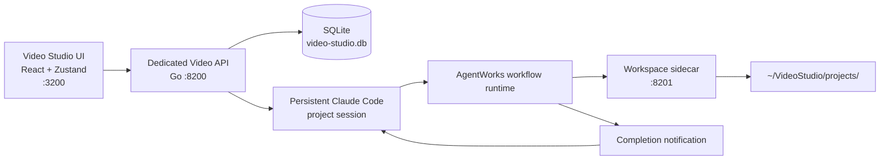

# Video Studio — Handover

**Last updated:** 2026-08-05
**Repository:** `/Users/mipl/ai-work/mcp-agent-builder-video`  
**Local product URL:** `http://127.0.0.1:3200`  
**Local login:** `manish` / `12345`  
**Status:** working end to end. A full cinematic run completes research → delivery and produces a verified playable MP4. Three pipelines exist behind a router, including independent video QA. **A per-user Claude Code setup token is now required before any session can start** — see "Provider authentication".

## Product intent

Video Studio is a separate, local-first, chat-driven product for making videos. It reuses AgentWorks workflow execution and Claude Code, but hides framework and provider details from users.

- One continuous Claude Code session per project, resumed across chat turns.
- One large local workspace with many projects.
- A project owns uploaded assets, workflow artifacts, generated videos, and chat history.
- Projects are private today; the schema supports shared projects later.
- The user should see friendly progress, not internal tools, provider names, keys, locks, knowledge bases, or AgentWorks terminology.
- Local-only for now. AWS, Google sign-in, Slack, WhatsApp, GWS, publishing, and collaboration UX are deferred.

### Two decisions that constrain everything else

**No tools beyond shell and skills.** Stages do their work with `execute_shell_command` and skills. No bespoke media tools were added, deliberately. The only product-specific tool is `show_video` (below), which is presentation, not production.

**AgentWorks-style native shell, not SparkQuill child isolation.** Video Studio is a trusted local agent product. Its project agent uses the ordinary non-strict workspace profile, and the launcher sets `NATIVE_WORKSPACE=true` for both the API and workspace sidecar. The agent can use Homebrew tools, the user's package caches, and install production runtimes through `execute_shell_command`. Project guards still keep `uploads/` and `.claude/` read-only. Do not set `StrictAllowlist: true`; that is the SparkQuill child-agent trust model.

**Step description = WHAT, skill = opinionated HOW.** A stage description says what to produce. A skill is an opinionated method for doing it. **Not every step needs a skill** — if the description is the whole job, the stage has no skill and that is correct. Do not add skills for symmetry.

## Provider authentication (setup token) — required

Video Studio no longer uses whatever Claude Code login happens to exist on the machine. **Each user must supply their own `claude setup-token` credential before a session can start.**

The failure this closes is specific: the provider silently falls back to the CLI's saved login, logging "using the CLI saved login". An absent token is not a degraded session — it authenticates and bills as whoever set up that terminal.

| Piece | Location |
|---|---|
| Gate at session construction | `agentsession.Config.ClaudeCodeOAuthToken` + `RequireProviderToken`; `New()` refuses to build the session |
| Token → adapter | `RuntimeConfig.Generation.APIKeys` (`mcpagent.AgentAPIKeys`) — this was never set before |
| Storage | Existing encrypted per-user vault, reserved name `videoproduct.ClaudeCodeTokenSecret` (`CLAUDE_CODE_OAUTH_TOKEN`) |
| Validation | Shared `agent_go/internal/claudeauth` |
| UI | "Claude Code token" card in Settings |

Behaviour to preserve:

- **The gate is at session/terminal start, not per turn.** The session either starts authenticated as this user or does not start.
- **`SecretEnv` deliberately excludes the token.** Other secrets are exported as env vars into shell commands the agent runs; the provider credential must not be, or any command could re-authenticate on its own. `TestProviderTokenIsNotExportedToTheShellEnvironment` pins this.
- **Chat returns 428** with an actionable message so the UI can route the user to Settings. `TestChatIsRefusedWithoutAClaudeCodeToken` pins this.
- The generic `PUT /api/secrets/{name}` route **rejects** the reserved name, so nothing can store a token that skipped validation.
- The auto-notification path returns early without a token — nobody is watching it to prompt.

### `claude auth status` does NOT validate a token

Verified live 2026-08-05: `claude auth status --json` returns `{"loggedIn":true,"authMethod":"oauth_token"}` and exit 0 for **any** non-empty `CLAUDE_CODE_OAUTH_TOKEN`, including outright garbage. It never contacts the server — it is a structural check, not a validity check.

AgentWorks' `validateClaudeCodeOAuthToken` relied on that alone, so it had been accepting dead and mistyped tokens all along. Real validation requires a round trip:

```
claude -p "hi" --model claude-haiku-4-5 --max-turns 1
→ exit 1, stdout: "Failed to authenticate. API Error: 401 OAuth access token is invalid."
```

`internal/claudeauth.ValidateOAuthToken` now does the structural pass first (for clear "CLI not installed" / "not an OAuth credential" errors) then the round trip that actually proves it. Cost is one tiny Haiku request per token save. **Do not optimise the round trip away.** AgentWorks' `cmd/server/workflow_provider_auth.go` delegates to this same function so the two cannot drift.

## tmux session namespace and orphan sweep

Video Studio owns the **`video-*`** tmux prefix. Three products share one tmux server on this machine:

| Product | Prefix |
|---|---|
| AgentWorks | `mlp-*` (multi-llm-provider-go's unmodified default) |
| family-server / SparkQuill | `sq-*` |
| **Video Studio** | **`video-*`** |

`cmd/video-server/main.go` sets `CLAUDE_CODE_TMUX_SESSION_PREFIX=video-claude-code` (plus cursor/codex/pi) before anything else runs, then calls `startTmuxSweepLoop()` (`cmd/video-server/tmux_sweep.go`), copied from family-server: sweep at startup with `minIdleAge=0` (kill every match — nothing can be legitimate before the first request), then hourly at 45 minutes idle.

**The prefix is what makes the sweep safe.** The sweep matches by prefix only, so pointing it at `mlp-*` would kill live AgentWorks sessions. Never do that.

A graceful SIGTERM already closes owned sessions via `agentsession.CloseAllInteractiveSessions()`; the sweep exists for crashes and `kill -9`.

## OpenMontage is an important reference

The local reference clone is at `/Users/mipl/ai-work/OpenMontage`. It demonstrates an agentic video-production system with explicit pipelines, provider/tool selection, generation, composition, and multi-point QA.

Use it as a **product and architecture reference, not as code to copy.** OpenMontage is **AGPLv3**; do not transplant its code without an explicit licensing decision.

**Pipeline == workflow.** The two words mean the same thing; OpenMontage calls them pipelines, Video Studio calls them workflows.

| OpenMontage concept | Where it lives there | What Video Studio did with it |
|---|---|---|
| Pipelines as data | `pipeline_defs/*.yaml` | `pipelines.go` — a registry of Go structs (done) |
| Per-stage director skill | `skills/pipelines/<pipeline>/<role>-director.md` | One skill per stage **that needs one** |
| Shared skills | `skills/meta/*`, `skills/core/*` | Reused by every pipeline — where reuse actually happens |
| `checkpoint_required` | per stage | `PipelineStage.RequiresApproval` |
| `success_criteria` e.g. "All file paths resolve to existing files" | per stage | `PipelineStage.Artifacts` — makes "wrote a manifest but generated nothing" a stage failure |
| `render_runtime` locked at proposal | `meta/animation-runtime-selector.md` | Chosen at proposal, carried through unchanged |

**Skill layering.** The main project chat agent gets **all** skills so it can route and answer anything. Each pipeline **stage** agent gets only its own skill plus shared ones. Role names are shared across pipelines but content genuinely diverges (their `compose-director` is 445 lines for explainer vs 89 for cinematic): **share the taxonomy and the meta/core skills; keep director content per pipeline.**

Local runtime reality: **ffmpeg 8.0** at `/opt/homebrew/bin/ffmpeg` (verified end to end). HyperFrames is **agent-managed, not a machine-global prerequisite**: when an approved plan selects it, the agent uses `npx --yes hyperframes@latest`, whose first invocation installs the latest published CLI into npm's cache. A missing global `hyperframes` command is expected and must never be handed back to the user as setup work. Do not use Doctor's top-level `.ok` as a universal render gate: 0.7.94 reports `.ok: false` when optional transcription/TTS/music helpers are absent even though Version, Node.js, FFmpeg, FFprobe, Chrome, unzip, and Docker all pass. Gate only the capabilities required by the selected operation.

## Architecture



### Main implementation locations

| Area | Location |
|---|---|
| Product backend | `agent_go/internal/videoproduct/` |
| **Pipeline registry (stages as data)** | `agent_go/internal/videoproduct/pipelines.go` |
| Workflow plan/router/bridge | `agent_go/internal/videoproduct/workflow.go` |
| Project chat agent, tools, system prompt | `agent_go/internal/videoproduct/agent.go` |
| Encrypted secret vault | `agent_go/internal/videoproduct/vault.go` |
| **Shared setup-token validation** | `agent_go/internal/claudeauth/` |
| **Shared execution-event contract and storage** | `agent_go/internal/platformevents/` |
| Session construction + token gate | `agent_go/internal/agentsession/agentsession.go` |
| Dedicated server entry point | `agent_go/cmd/video-server/` |
| **tmux prefix + orphan sweep** | `agent_go/cmd/video-server/tmux_sweep.go` |
| Product skills | `agent_go/internal/videoproduct/skills/` |
| Video Studio frontend | `frontend/video-app/` |
| Product state and chat streaming | `frontend/video-app/src/store.ts` |
| **Shared event client, reducer, hook, and renderer** | `frontend/packages/execution-events/` |
| Video Studio shell and product screens | `frontend/video-app/src/VideoApp.tsx` |
| Local launcher | `scripts/run-video-studio.sh` |

### Runtime and storage

| Service | Port | Notes |
|---|---:|---|
| Video Studio frontend | 3200 | Separate Vite app |
| Video Studio API | 8200 | Separate Go server |
| Workspace sidecar | 8201 | AgentWorks workspace/document API |
| Product database | — | `~/VideoStudio/video-studio.db` |
| Project folders | — | `~/VideoStudio/projects/<project-id>/` |

**Database scope is deliberately minimal:** project name and project ID, plus chat/session/run bookkeeping. Pipeline identity is **not** stored — it is derived from the plan. Do not add a `pipeline_id` column.

The workflow's real stage artifacts live under:

```text
~/VideoStudio/projects/<project-id>/runs/iteration-<n>/<group>/execution/<step-id>/
```

`work/` and `outputs/` are **not** the workflow source of truth. `outputs/` holds final delivered videos; workflow artifacts are only under `runs/`. Confusing the two caused a bad chat response during the original failing run.

## Pipelines

Stages live in `pipelines.go` as Go structs and are **internal to the product** — hardcoded on purpose, not authored by an agent. This was an explicit decision: *"Video Studio's Go code writes them. The stage list lives in pipelines.go as Go structs — this is what we need."*

`PipelineStage` carries `Summary`, `Skills`, `RequiresApproval`, and `Artifacts`. `pipelineRegistry` holds all pipelines; `AllPipelineSteps()` seeds every step row for every pipeline.

### Routing

Routing is native to AgentWorks — a `RoutingPlanStep`, not a bespoke mechanism. `planForAll()` emits the routing step plus both branches, each ending `next_step_id: "end"`.

`run_full_workflow` takes **both** a route selection and human input: `route_selections` (`{"route": "cinematic"}`, `{"route": "infographic"}`, or `{"route": "quality"}`) picks the pipeline, while `human_inputs` carries what the user wants from it. The main Video Studio agent infers this choice from the brief; users are never asked to choose an internal route.

### 1. Cinematic video

Research → Creative proposal → Script → Scene plan → Assets → Edit plan → Compose → Quality check.

**Proven live:** a full run completed research → delivery and produced a verified **15.000s 1080x1920 h264/aac** MP4 using ffmpeg placeholders, at zero API generation cost.

### 2. Product explainer / infographic (HTML)

Builds panels as HTML, screenshots them with headless Chrome, and animates with ffmpeg. Skill: `skills/html-composition/SKILL.md` (canvas discipline, headless Chrome, ffmpeg motion, quality gate).

**Partly proven:** routing to this branch works, and the HTML panels are of genuinely high quality (verified via contact sheet). **It has never produced a video itself** — see Known gaps.

### 3. Video quality assurance

An independently routable, single-stage workflow for inspecting an existing render without rebuilding it. The production workflows also end with the same mandatory QA contract.

QA is agentic: the stage prompt plus the embedded `video-quality` skill direct the agent to use shell media analysis, create and visually inspect a contact sheet, check audio/captions/content/promise preservation, repair safe mechanical problems, and re-check failures. There is no bespoke QA scoring tool.

Every passing QA run must produce:

- a plain-language delivery report;
- `quality-report.json`, naming the exact project-relative candidate and carrying per-category status/evidence;
- `qa-contact-sheet.jpg` plus at least four recorded inspected frames.

`show_video` requires the path to this report and acts only as a deterministic evidence gate. It refuses missing or malformed reports, a non-passing verdict, a report for a different video, missing frame/contact-sheet evidence, or a placeholder pass that is not labelled as such. Creative and editorial judgment stays with the agent and skill.

## Internal commands and tools

The product chat agent exposes:

- `execute_step` — one named stage
- `query_step` — status only when the user asks
- `run_full_workflow` — a new multi-stage production, or all remaining authorised stages, with `route_selections` + `human_inputs`
- `show_video` — pin a specific video into the right-hand Videos panel

`show_video` validates against path escape, checks the video extension, and rejects empty paths. It writes to the `presented_videos` table; `projectVideos` prefers presented videos and falls back to a directory scan.

Workflow steps intentionally set learnings, knowledge-base, and workflow DB access to `none`.

The project agent chooses the execution mode automatically: direct chat for one coherent creation or revision, `execute_step` for a targeted/retried/approval-bounded stage, and `run_full_workflow` for a new multi-stage production. A normal request to create a video authorises planning and local production; only paid generation, publishing, external uploads, or genuinely missing consequential choices require another approval.

### UI conventions

- **The Workflow tab is a static view.** It shows what the latest routed pipeline does — nothing else. It is deliberately not a live run monitor. (An earlier change made it live; that was reverted on request.)
- Live activity appears in chat through the shared normalized execution-event feed. It displays the runtime's real names and statuses; it does not infer stages, percentages, or pipeline identity from stale workflow rows.
- The normalized contract is owned by `internal/platformevents/contract.json` and imported by the frontend package. Product/provider adapters translate raw AgentWorks events into `tool_started`, `tool_completed`, `tool_failed`, `run_started`, `run_completed`, `run_failed`, and `run_cancelled`.
- Streamed deltas and the `.stream-think` Thinking block remain product presentation layered over the shared execution state.
- Thinking-token streaming was ported from sparkquill (commit `69594b934`) — it is **frontend presentation only**, not a backend change.

## Work completed

### Product

- Separate frontend, backend entry point, ports, SQLite storage, local authentication, local workspace tree.
- Chat-first UI: dashboard, assets/files, videos, static workflow inspector, Markdown rendering, tool activity panel.
- Shared normalized execution-event storage plus reusable frontend client, reducer, polling hook, and activity renderer; Video Studio owns only its composition and styling choices.
- Per-project stable, resumable agent and workflow session; Claude Code only, `claude-sonnet-5`.
- Three pipelines behind a native routing step: cinematic, product explainer/infographic, and video quality assurance.
- Data-driven stages in `pipelines.go`, with per-stage skills and artifact enforcement.
- `show_video` tool + `presented_videos` table.
- Thinking-token streaming; reduced left/right spacing so chat and sidebar get more room.
- Per-user setup-token requirement, encrypted vault storage, Settings UI, shared validation.
- `video-*` tmux namespace and orphan sweep.
- Agent-managed latest HyperFrames setup on first use; no global CLI prerequisite.
- Mandatory agentic post-render QA with a shared evidence contract and `show_video` presentation gate.

### Bugs found and fixed

| Bug | Cause | Fix |
|---|---|---|
| Media tools 401 inside stages (original P0) | Tool registry snapshotted `MCP_API_TOKEN` **before** `ensureSharedBridge` set it, then cached it forever | `WarmSharedBridge` at startup + re-derive on session reuse |
| Contradictory auto-notification (original P0) | Main agent was asked to infer terminal state from an unstructured string | Pass structured facts in the synthetic event |
| `Cinematic video` label + `11 ms` (original P1) | Label always used `DefaultPipeline`; 11ms timed the dispatch, not the work | `pipelineFromArgs`; status `started` with no duration |
| Infographic step statuses silently dropped | `SetWorkflowStep` is UPDATE-only, so rows that never existed matched nothing | `AllPipelineSteps()` seeding + `stageIDFromName` across all pipelines |
| Stages given no skills | Used `selected_skills` (a workshop preset key) at step level instead of `enabled_skills` | Correct key |
| "already registered" skill panic in tests | Skill registry is process-global; `NewServer` is not | `sync.Once` in `registerProductSkills()` |
| `infographic-design` produced no panels | Validation only required its `.md` | `PipelineStage.Artifacts` + rewritten description; title "Design panels" → "Build panels" |
| `readWorkspaceFile` dead code | "File does not exist" nested under `if !apiResp.Success`, but the sidecar returns `success:true` | Moved the check outside |
| Pre-commit hook blocked frontend commits | `REPO_ROOT` computed **after** `cd agent_go`; with `GIT_DIR` set it resolved to cwd | Moved above the `cd` |
| IME users could submit mid-composition | Missing composition guard | `!event.nativeEvent.isComposing` |
| AgentWorks accepted invalid tokens | `claude auth status` does not validate (see above) | Real round trip in shared `claudeauth` |
| Agent could invoke `npx`, but it failed with `env: node: No such file or directory` | Video Studio accidentally used SparkQuill-style `StrictAllowlist` plus the generic container environment | Align with AgentWorks: ordinary non-strict project profile and `NATIVE_WORKSPACE=true` for the API and workspace sidecar |

## Known gaps

**The infographic pipeline has never produced a video itself.** The render fix is untested. This is the highest-value next check — routing and panel quality are proven, the render is not.

**A bad provider token hangs instead of failing fast.** With a known-bad token a turn hung ~121s rather than surfacing `401 OAuth access token is invalid`. Validation-at-save-time means this is rarely hit, but a **revoked or expired** token would present as a hang, not an error. Worth fixing.

**`read_image` returns 404 from inside stages.** Not diagnosed.

**Provider keys are not user-configurable** beyond the Claude Code token. Closed deliberately with REOPEN conditions.

**~8 lingering `mlp-*` tmux sessions** from AgentWorks, some dating to 2026-08-01. AgentWorks' own sweep spares them because they predate its PID-tagging. Not Video Studio's to clean.

## Testing philosophy

**Live browser testing is the primary method.** A large test suite is not wanted yet — too much is still changing. Unit/mocked tests count as zero coverage for coding-agent behaviour.

The existing Go tests are a regression floor, not a specification. Two lessons from this work:

1. **Verify which binary is serving.** A restart once silently failed to bind 8200, so a test ran against a stale binary and produced a confident, wrong bug report. Check `lsof -ti:8200 -sTCP:LISTEN` and the process path.
2. **Agent self-reports are unreliable in both directions.** An agent claimed a tool was unavailable when it was, and claimed success elsewhere. Confirm against artifacts.

Also: **do not restart the server while a run is in flight.** Doing so severs the MCP bridge mid-stage. Check for in-flight runs first:

```bash
sqlite3 ~/VideoStudio/video-studio.db \
  "SELECT id,status,updated_at FROM workflow_runs WHERE status NOT IN ('completed','failed','cancelled');"
```

## Useful commands

```bash
cd /Users/mipl/ai-work/mcp-agent-builder-video
./scripts/run-video-studio.sh
```

```bash
# Backend tests
cd /Users/mipl/ai-work/mcp-agent-builder-video/agent_go
GOWORK=off go test ./internal/videoproduct ./internal/claudeauth -count=1
```

```bash
# Confirm which binary is actually serving
lsof -ti:8200 -sTCP:LISTEN | xargs -I{} ps -o command= -p {}
```

```bash
# Provider token status (never returns the value)
curl -s -b cookies.txt http://localhost:8200/api/provider-token
```

```bash
# tmux sessions by owning product
tmux ls -F "#{session_name}" | sed 's/-[0-9]\{10,\}.*//' | sort | uniq -c
```

```bash
# Same managed HyperFrames check the agent uses; first invocation installs latest
npx --yes hyperframes@latest doctor --json
```

## Repository hygiene

The worktree is dirty, including unrelated AgentWorks and frontend edits. Do not reset, checkout, or bulk-revert. Keep changes scoped to Video Studio paths unless intentionally fixing the shared AgentWorks workflow runtime — and when a bug exists in both places, **fix it in both** (as done for `claudeauth`).
