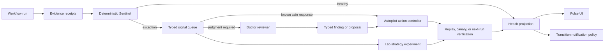

# Pulse v2: Proof-Carrying Workflows and Exception-Driven Autonomy

> **Status:** Architecture proposal  
> **Date:** 2026-07-29  
> **Scope:** Per-workflow Pulse, its post-run control loop, review/fix model,
> durable state, reporting, notification, and relationship with Goal Advisor.

## Executive summary

Pulse is pursuing the right product outcome: let a small team operate 100+
autonomous workflows by exception rather than watching every run.

The current implementation is increasingly achieving that outcome through a
large prompt-driven control plane. Gate, reviewer coordination, fixing,
verification, recovery, reporting, backup, publishing, and notification are
distributed across scheduler prompt literals, reference documents, SQLite
tables, Markdown reviewer artifacts, visible HTML, hidden HTML recovery state,
dashboard cards, changelogs, and run metadata.

That approach has produced meaningful improvements, but it is accumulating
contract drift and operational fragility. Recent production bugs show the
pattern: each failure adds another prompt rule, reminder, state field, recovery
condition, or regression assertion. The local behavior becomes safer while the
overall system becomes harder to understand and verify.

This proposal changes the abstraction:

- Pulse stops being an agent and becomes a deterministic protocol.
- Workflow runs become **proof-carrying**: their claims are backed by typed
  evidence receipts.
- A code-owned **Sentinel** converts receipts and runtime facts into durable,
  fingerprinted signals.
- A policy engine schedules work by exception, risk, recurrence, freshness, and
  budget. It does not use an LLM for facts the runtime already knows.
- Agentic **Doctor** reviewers are invoked only when semantic judgment or
  diagnosis is genuinely required.
- A typed **Autopilot** action controller applies only narrow, reversible,
  policy-approved changes.
- A separate **Lab** owns strategic experiments and canary comparison. Goal
  strategy no longer shares a fixer context with operational maintenance.
- The user-facing **Pulse** becomes a deterministic projection of the event
  ledger, not an agent-authored source of operational truth.

The intended steady state is:

> Healthy runs consume zero maintenance-model tokens. Broken or uncertain
> claims buy exactly the judgment they need.

## Product outcome

Pulse exists to make autonomous workflow operations scale.

It should answer five questions:

1. Did the workflow actually do what it claimed?
2. Is the evidence current, complete, and tied to the correct run?
3. What materially changed since the previous trustworthy state?
4. Does anything require repair, deeper judgment, or a user decision?
5. Can a proposed repair be verified safely before it is promoted?

The human should manage exceptions and decisions. The amount of routine human
work should scale with the number of genuine exceptions, not the total number
of workflows or runs.

## Current architecture

The current Pulse loop is broadly:

1. A Gate agent scans compact evidence and records one due/skipped decision per
   module.
2. A consolidated parent launches read-only module reviewers in batches.
3. The same parent becomes the single Pulse Fixer and applies bounded changes.
4. A finalizer updates the dashboard, backs up, publishes, and notifies.
5. SQLite, reviewer Markdown, `builder/improve.html`, cards, and run metadata
   preserve different parts of the outcome and recovery state.

The canonical module set currently contains:

- `bug_review`
- `artifact_review`
- `report_health`
- `eval_health`
- `stores_health`
- `llm_ops_review`
- `strategy_auditor`
- `goal_advisor`

The July 2026 work materially improved Pulse:

- recurring `CONCERNS:` are now durable and deduplicated;
- reviewer executions and verdicts are logged independently from fixer results;
- plan changes have a durable unreviewed-impact backlog;
- real evaluation verdicts are queryable through `db.sqlite`;
- Ops Review can inspect cost, timing, and tool-call efficiency;
- three store reviewers were consolidated into `stores_health`;
- the operator-facing log gained fixed/open separation and visible review
  coverage;
- scheduler outcome reconciliation and several production-only failure paths
  were corrected.

Those are valuable foundations. The proposal keeps the durable evidence and
state discipline while changing who owns classification, scheduling, action,
and presentation.

## Critical assessment

### 1. Prompt prose is acting as executable control logic

Important invariants currently live in natural-language contracts:

- the exact module set;
- how many reviewers may run;
- whether every due module must run;
- which tool transport is permitted;
- what a reviewer may read or write;
- mutation precedence;
- recovery behavior;
- when a change is verified;
- when notification is required;
- how state must be mirrored between HTML and SQLite.

These are program semantics. Natural-language guidance is useful for judgment,
but it is a weak enforcement layer for exact state-machine behavior.

The current prompt surface also has several copies:

- scheduler literals in `agent_go/cmd/server/scheduler.go`;
- `pulse-gate.md`;
- the 800+ line `post-run-monitor.md`;
- `pulse-review-fixer.md`;
- per-module guidance;
- `pulse-finalizer.md`;
- `review-improve-log.md`;
- documentation under `docs/workflow`.

A recent production pass never loaded a required formatting contract, despite
the contract being present elsewhere. The repair copied an explicit reminder
into every literal module message because that was the only guaranteed-seen
surface. This is evidence that the prompt hierarchy is no longer behaving like
one reliable program.

### 2. The control plane uses an LLM for deterministic facts

Gate currently reasons over many facts already known by code:

- run success or failure;
- missing or failed steps;
- current evaluation scores;
- presence of unreviewed plan changes;
- open concern recurrence;
- last module review;
- missing baseline;
- cost and timing deltas;
- backup and publish status;
- unanswered human input;
- exact model pins;
- workflow contract version.

An LLM may be useful to interpret ambiguous evidence. It should not be
responsible for basic scheduling arithmetic or for remembering the canonical
module set.

Using an agent on every healthy run also works against the manage-by-exception
goal. For example, 100 workflows running ten times per day would create at
least 2,000 Gate/finalizer turns per day before any reviewer was selected.

### 3. “Module” is carrying too many responsibilities

The module name is currently used as:

- a scheduling category;
- a reviewer specialization;
- a state-table key;
- a result/audit key;
- a reporting category;
- a cadence owner;
- a conflict-resolution participant;
- a UI filter.

This encourages either module proliferation or overly broad reviewers.
Consolidating learnings, knowledgebase, and database review into
`stores_health` reduces the number of module names, but creates a reviewer whose
domain is wider and whose attention is less predictable.

The correct unit of scheduling is a **signal**, not a module:

- `eval.score_missing`
- `run.failed`
- `receipt.destination_mismatch`
- `plan.change_unreviewed`
- `cost.turn_generation_bound`
- `store.reference_unconfirmed`
- `review.baseline_due`

Signals may be routed to a reviewer skill, a deterministic action, a future
checkpoint, or a user decision. The reviewer’s skill label does not need to be
the state machine’s primary key.

### 4. Operational truth is fragmented

Pulse state currently spans:

- `pulse_module_state`;
- `pulse_module_audit`;
- `pulse_review_log`;
- `run_concerns`;
- `pulse_fix_attempts` and `pulse_fix_attempt_findings`;
- `pulse_fix_verifications` and `pulse_finding_events`;
- `pulse_final_command_state`;
- `eval_results`;
- full reviewer Markdown stored as TEXT in `pulse_review_log` (with retained
  legacy `pulse/reviews/**/*.md` files during the v1.0.17 compatibility window);
- `builder/improve.html`;
- the hidden `#pulse-agent-handoff` recovery marker;
- dashboard cards;
- plan changelog JSON;
- run metadata and schedule history.

Some duplication is intentional, but recovery guidance must now explain which
copy is authoritative and how to repair one mirror from another. Once a
recovery process has to reconcile HTML, SQLite, reviewer artifacts, and
scheduler state, presentation has become part of the transaction protocol.

The system needs one immutable operational ledger and code-owned projections.

### 5. Agent-authored HTML is both a report and a state carrier

`builder/improve.html` is valuable as a human-readable view. It should not be an
operational source of truth or a recovery mechanism.

Requiring an LLM to:

- preserve exact HTML structure;
- apply new design contracts;
- avoid jargon;
- maintain hidden matching attributes;
- keep one timeline anchor;
- update current cards without duplication;
- preserve archive history;
- carry interrupted-fix recovery state;

creates an avoidable failure surface. The formatting contract itself has
already drifted in production.

The UI and static published page should be rendered from structured state.
Agents should author findings and explanations, not DOM structure.

### 6. The single Fixer is too broad

The single-writer decision correctly prevents concurrent mutation, but the
writer’s responsibility is enormous. In one turn it may reconcile:

- correctness findings;
- plan drift;
- report and evaluation contracts;
- learnings, knowledgebase, and database changes;
- model and operations recommendations;
- strategic Goal Advisor proposals;
- human input;
- HTML;
- module state.

The fixed precedence rules reduce conflict but do not reduce cognitive load or
the breadth of authority.

The safer abstraction is a typed action queue. Reviewers propose actions;
code-owned policy decides which action types can execute automatically.

### 7. Correctness and strategy are mixed

Goal Advisor has different evidence, cadence, risk, and verification needs from
operational repair.

Correctness asks:

> Did the intended mechanism work?

Strategy asks:

> Is this still the best mechanism or thesis?

Putting both through the same worklist and Fixer context increases the chance
that maintenance dominates strategy, or that a strategic change acquires the
appearance of a routine safe repair.

Strategy should run as an experiment lifecycle, not a maintenance module.

### 8. Deterministic final commands are agent-orchestrated

Dashboard projection, backup eligibility, publish eligibility, and
transition-based notification are largely deterministic jobs. An agent may
write a useful summary, but it should not own the exact command state machine.

The finalizer should be a code-owned saga:

1. render projections;
2. create/verify backup;
3. publish if eligible;
4. notify if policy selects a transition;
5. record each terminal result.

An LLM can optionally produce user-facing narrative from a bounded structured
packet.

## Concrete contract drift found during review

These examples are symptoms of the architectural issue, not isolated mistakes:

| Area | Current conflict |
|---|---|
| Module count | `pulseModuleOrder` contains eight modules, while the scheduler Gate prompt still asks for “all ten module decisions.” |
| Reviewer whitelist | `stores_health` is scheduled, but reviewer artifact path validation still accepts the three retired store module names instead. |
| Work budget | The local Gate guidance caps a pass at three due modules, while `post-run-monitor.md` says every due module must run and explicitly forbids selecting only a top three. |
| Reviewer transport | `post-run-monitor.md` forbids shell/curl wrapping, while `pulse-review-fixer.md` calls the shell/API bridge the supported transport. |
| Notification policy | Product documentation promises notification only on meaningful transitions, while the finalizer says to notify every run. |
| Canonical docs | `docs/workflow/pulse_consolidation.md` still describes ten modules and earlier concurrency even though the implementation has moved to eight modules and batches of two. |

The immediate bugs should be fixed, but manually synchronizing all copies will
not prevent the next drift. Canonical registries and typed policy must generate
or replace these contracts.

## Design principles for Pulse v2

1. **Prove claims instead of trusting summaries.**
2. **Use deterministic code for deterministic facts and state transitions.**
3. **Invoke agents only for semantic judgment, diagnosis, or explanation.**
4. **Schedule signals, not broad maintenance departments.**
5. **Represent every action as a typed, bounded, reversible operation.**
6. **Make verification a first-class state machine.**
7. **Keep strategy experiments separate from operational repair.**
8. **Maintain one immutable source of operational truth.**
9. **Render UI, HTML, cards, and notifications as projections.**
10. **Make the healthy path cheap, quiet, and boring.**

## Target architecture



### Sentinel

Sentinel is deterministic and runs for every workflow execution.

Responsibilities:

- normalize run, step, evaluation, cost, timing, concern, and external receipt
  evidence;
- evaluate machine-checkable claims;
- fingerprint and deduplicate exceptions;
- update recurrence and freshness;
- detect state transitions;
- emit typed signals;
- apply deterministic policy for priority, budget, and next check;
- complete the healthy path without an LLM.

Sentinel does not diagnose ambiguous causes and does not mutate workflow design.

### Doctor

Doctor is the agentic diagnosis layer.

It is invoked only for signals that require semantic interpretation, root-cause
analysis, or judgment.

Doctor receives:

- exact signal IDs;
- a bounded evidence packet;
- the relevant workflow contract;
- the applicable reviewer skill;
- a strict structured response schema.

Doctor returns:

- findings;
- confidence;
- evidence references;
- proposed typed actions;
- verification requirements;
- user-judgment requirements;
- remaining uncertainty.

Doctor does not write workflow files or operational state.

### Autopilot

Autopilot is the action controller.

It accepts only registered action types, for example:

- `update_prompt_contract`
- `update_validation_rule`
- `repair_report_query`
- `refresh_store_index`
- `open_human_decision`
- `schedule_recheck`
- `restore_previous_version`

Every action contains:

- target identity;
- expected current version or hash;
- bounded patch or parameters;
- risk class;
- required approval class;
- rollback operation;
- verification plan;
- originating finding IDs.

Unknown or overly broad actions are rejected or converted into proposals.

### Lab

Lab owns strategy and structural experiments.

Its lifecycle is:

```text
hypothesis
→ baseline
→ proposed variant
→ approval when required
→ shadow/canary execution
→ measurement
→ adopt, revise, reject, or retire
```

Goal Advisor becomes one Lab reasoning skill. It does not share an operational
Fixer context with correctness, database, or reporting repairs.

### Pulse

Pulse remains the user-facing product name and operational view.

It becomes a projection showing:

- current Bug and Goal status;
- new or worsening exceptions;
- repairs applied and their verification state;
- pending decisions;
- active strategy experiments;
- cost/time changes;
- backup/publish status;
- the next meaningful checkpoint.

It is rendered from structured data. Agents provide concise explanatory text
inside typed findings and outcomes, but they do not maintain the page’s HTML
structure.

## Proof-carrying workflows

### Claims

Each step or workflow declares the claims that must hold.

Example:

```yaml
claims:
  - id: source-is-current
    kind: freshness
    expected: source timestamp is inside the configured window
    evidence_source: step-output.source_timestamp
    risk: correctness

  - id: post-published-to-configured-account
    kind: external_side_effect
    expected: one post exists in the configured destination account
    evidence_source: tool-receipt
    risk: externally_communicating

  - id: report-reflects-current-run
    kind: data_binding
    expected: every visible metric is bound to the current run folder
    evidence_source: report-query-manifest
    risk: correctness
```

Claims may be generated from plan metadata and validation schemas, then refined
explicitly for side-effecting or high-risk paths.

### Evidence receipts

Runtime tools and steps return typed receipts:

```json
{
  "claim_id": "post-published-to-configured-account",
  "run_id": "iteration-42",
  "verdict": "proved",
  "observed": {
    "destination_account_id": "account-7",
    "post_id": "post-123",
    "created_at": "2026-07-29T10:00:00Z"
  },
  "source": {
    "tool": "publish_post",
    "receipt_id": "receipt-abc"
  }
}
```

Possible verdicts:

- `proved`
- `disproved`
- `unknown`
- `not_exercised`
- `stale`

A step completion summary is explanatory evidence, not proof by itself.

### Machine and semantic verifiers

Claims should declare their verifier:

- deterministic JSON/schema assertion;
- database query;
- artifact hash or manifest;
- signed external tool receipt;
- browser/screenshot assertion;
- evaluation criterion;
- semantic LLM judge.

Semantic judging remains available, but it becomes one verifier type rather
than the default control mechanism.

## Signal model

A signal is a durable exception or scheduled need:

```json
{
  "signal_id": "sig-...",
  "type": "receipt.destination_mismatch",
  "subject": "step:publish-linkedin",
  "severity": "critical",
  "risk": "externally_communicating",
  "state": "open",
  "first_seen_run": "iteration-40",
  "last_seen_run": "iteration-42",
  "seen_count": 2,
  "evidence_refs": ["receipt:abc", "claim:post-published"],
  "confidence": 1.0,
  "route": "doctor:bug-diagnosis",
  "next_check": "next_applicable_run"
}
```

Suggested signal families:

- `run.*`
- `step.*`
- `receipt.*`
- `eval.*`
- `report.*`
- `plan.*`
- `store.*`
- `cost.*`
- `model.*`
- `backup.*`
- `publish.*`
- `notification.*`
- `review.*`
- `experiment.*`

Signals replace module-specific scheduling state. Reviewer skills can still be
grouped for operational convenience, but routing is based on signal type and
risk.

## Event ledger and projections

Use one immutable `pulse_events` ledger:

```text
run.observed
claim.evaluated
signal.opened
signal.recurred
signal.acknowledged
review.requested
review.completed
finding.created
action.proposed
action.approved
action.started
action.applied
verification.pending
verification.passed
verification.failed
signal.closed
backup.completed
publish.completed
notification.sent
```

Each event contains:

- event ID;
- workflow ID/path;
- Pulse/run identity;
- event type;
- subject identity;
- causation and correlation IDs;
- structured payload;
- evidence references;
- actor;
- timestamp.

Code-owned projections provide:

- current workflow health;
- open signals;
- review queue;
- pending actions;
- pending verifications;
- current backup/publish state;
- recent transitions;
- operator timeline;
- notification candidates.

SQLite is a reasonable first implementation. The key change is the event and
projection model, not the database engine.

## Policy and work budgeting

Policy should be deterministic and configurable.

Priority may consider:

- severity;
- external side-effect risk;
- recurrence;
- evidence confidence;
- regression versus baseline;
- age;
- review baseline status;
- cost of review;
- whether a safe deterministic action exists;
- whether the signal blocks goal evidence;
- whether another active action targets the same subject.

Example policy:

```text
critical correctness or external-side-effect signal
  → immediate Doctor review, regardless of normal budget

known deterministic repair with high-confidence evidence
  → Autopilot action

new medium signal
  → review within current per-workflow budget

baseline audit without current risk
  → scheduled deep-maintenance window

stable healthy state
  → no reviewer and no maintenance LLM turn
```

If a three-review cap is desired, enforce it in code. Define what happens when
four critical signals exist; a hard cap may be unsafe unless high-severity work
can overflow or continue asynchronously.

## Typed actions and autonomy

Suggested risk classes:

### Class A: deterministic projection or bookkeeping

Examples:

- update a health projection;
- schedule a recheck;
- render a card;
- deduplicate a signal;
- update a freshness timestamp from verified runtime evidence.

Execution: automatic.

### Class B: narrow reversible workflow repair

Examples:

- fix a current-run binding;
- repair a known report query;
- restore a missing schema field;
- correct a validation rule without changing business meaning.

Execution: automatic only when:

- the action type is registered;
- the target hash matches;
- a rollback exists;
- verification can run safely;
- the change does not alter goal semantics or external destinations.

### Class C: consequential operational change

Examples:

- change model/provider;
- change destination, recipient, account, or schedule;
- modify database semantics;
- change a threshold with business meaning;
- modify external side-effect behavior.

Execution: proposal or exact prior approval.

### Class D: strategy or goal change

Examples:

- replace the workflow strategy;
- change success criteria;
- materially restructure the plan;
- start a new externally visible experiment.

Execution: Lab experiment with explicit policy and approval.

## Verification and canary promotion

Verification should be modeled explicitly:

```text
proposed
→ approved
→ applied_to_candidate
→ replaying_or_waiting_for_evidence
→ verified
→ promoted
```

Failure states:

```text
verification_failed
rolled_back
blocked
expired
superseded
```

For replayable workflows:

1. snapshot the current version;
2. apply the candidate change in a sandbox or worktree;
3. replay representative retained inputs;
4. compare claim verdicts, evaluation criteria, cost, timing, and artifacts;
5. promote only if required claims improve without a protected regression;
6. otherwise roll back and preserve the evidence.

For external side effects:

- use a dry-run endpoint, fixture, synthetic account, or read-only verification
  where available;
- never reproduce a real external action merely to prove a fix;
- keep the action awaiting the next legitimate evidence boundary when a safe
  canary is impossible.

## Reporting and notification

### Pulse UI

Render from projections rather than agent-authored HTML.

The UI should prioritize:

1. decisions requiring the user;
2. current workflow outcome;
3. newly opened or worsening exceptions;
4. repairs and proof state;
5. active experiments;
6. cost/time changes;
7. backup/publish status;
8. historical activity.

Static `pulse.html` publishing can reuse the same renderer or a server-generated
HTML template.

### Notifications

Notification policy should be transition-based:

- healthy → failed;
- failed → recovered;
- new critical signal;
- repeated unresolved signal crossing a threshold;
- action blocked on user decision;
- strategy experiment ready for decision;
- backup or publish became unsafe;
- configured periodic digest.

A steady healthy run should update the dashboard silently unless the user
explicitly requests per-run notification.

Narrative generation may use an LLM, but routing, recipients, channel selection,
deduplication, and send/no-send policy remain deterministic.

## Canonical ownership

| Concern | Owner |
|---|---|
| Run facts and receipts | Runtime |
| Claim evaluation | Sentinel/verifier registry |
| Signal state | Pulse event ledger and projections |
| Review judgment | Doctor reviewer artifact |
| Action authorization | Autopilot policy |
| Mutation execution | Typed action handler |
| Verification | Replay/canary/receipt verifier |
| Strategy experiments | Lab |
| UI and static HTML | Deterministic renderer |
| Notification eligibility/routing | Notification policy |
| Human-readable explanation | Reviewer/outcome narrative fields |

No HTML element or Markdown file is operational truth.

## Migration strategy

The redesign can be introduced incrementally.

### Phase 0: stop contract drift

- Fix the `stores_health` reviewer whitelist.
- Replace the stale “all ten modules” scheduler message.
- Resolve the three-module-cap contradiction.
- Resolve the direct-tool versus shell/API-bridge contradiction.
- Choose one notification policy and make code/docs agree.
- Update the superseded current-architecture documentation.
- Define one canonical Go registry for module metadata while modules still
  exist.
- Generate enums, validators, tool schemas, scheduler labels, and UI metadata
  from that registry.

### Phase 1: normalize evidence

Introduce a `RunObservation` or `EvidenceBundle` assembled deterministically at
run completion.

It should contain:

- run and step terminal states;
- claim receipts;
- validation outcomes;
- evaluation verdicts;
- costs and timings;
- current-run artifact manifests;
- concern recurrence;
- plan-change backlog;
- human-input state;
- backup/publish state;
- exact workflow/model versions.

Keep the existing Gate, but require it to consume this normalized bundle rather
than rediscovering facts across files.

### Phase 2: introduce deterministic signals

Create the signal ledger and policy engine.

Begin with unambiguous rules:

- failed run or step;
- missing required receipt;
- evaluation score missing or zero;
- stale/current-run mismatch;
- unreviewed plan change;
- repeated concern;
- review baseline due;
- material cost/timing change;
- backup/publish failure.

Run the policy engine in shadow mode beside Gate and compare selections.

### Phase 3: remove Gate from the healthy path

When deterministic policy and Gate agree reliably:

- complete healthy/no-exception passes without a Gate LLM;
- invoke an ambiguity classifier only for unclassified or conflicting signals;
- preserve the old Gate as fallback during rollout.

### Phase 4: structured findings

Require Doctor reviewers to return validated JSON findings and proposed typed
actions.

Continue rendering Markdown reviewer artifacts for forensic use, but generate
them from structured results.

### Phase 5: typed Autopilot actions

Build the action registry and begin with a narrow set of reversible repairs.

The existing Fixer may initially execute only actions issued by the queue. As
coverage grows, move each action type to a deterministic handler.

### Phase 6: deterministic projections

Render:

- current Pulse status;
- cards;
- activity timeline;
- published Pulse HTML;
- notification packets;

from projections. Remove the hidden HTML recovery ledger and stop asking agents
to migrate or repair page structure.

### Phase 7: separate Lab

Move Goal Advisor and material structural experiments into the Lab lifecycle.

Operational Pulse may open a strategy signal, but it does not perform the
strategy review or change in the same Fixer turn.

### Phase 8: retire legacy module orchestration

Once signal routing, structured reviewers, typed actions, and projections cover
the production cases:

- remove per-module Gate scheduling;
- remove module-state recovery coupling;
- retain reviewer skills as signal routes;
- migrate historical module events into the unified activity projection.

## Immediate implementation recommendations

Before adding further Pulse behavior:

1. Fix the committed `stores_health` launch blocker.
2. Resolve all current contract contradictions and add invariant tests.
3. Create a single registry for the temporary eight-module architecture.
4. Stop adding operational truth to `builder/improve.html`.
5. Define the first `RunObservation` schema.
6. Define five initial signal types and run deterministic selection in shadow
   mode.
7. Measure how often Gate makes a choice that could not have been made from
   deterministic facts.

That measurement will show how much of the current Gate actually requires an
LLM.

## Success criteria

Pulse v2 should be considered successful when:

- a healthy run completes Pulse without a maintenance LLM call;
- every workflow success claim has current typed evidence or is explicitly
  `unknown`;
- one immutable event ledger can reconstruct current Pulse state;
- HTML and cards can be deleted and regenerated without losing operational
  state;
- every automatic mutation is a registered typed action with rollback and
  verification;
- no strategic change can be applied through the operational repair lane;
- notification rate follows state transitions rather than run count;
- replayable fixes are canary-tested before promotion;
- recovery does not parse or repair hidden HTML;
- adding a reviewer skill does not require changing scheduler state-machine
  code, persistence schemas, and UI enums in several places;
- the user’s attention is consumed by exceptions and decisions, not routine
  successful runs.

## Open decisions

1. Which claim types should be mandatory for all workflows?
2. Should side-effecting tool receipts be signed or only content-addressed?
3. What is the first safe set of Class B automatic actions?
4. Which workflows can support deterministic replay today?
5. Should review budgets be per run, per workflow/day, or org-wide?
6. Which high-severity signals may overflow a normal review cap?
7. How long should unresolved signals remain open without renewed evidence?
8. Should static Pulse publishing happen on every state change or be
   source-hash gated?
9. Which Goal Advisor proposals may enter a canary without explicit approval?
10. How should historical `pulse_module_audit` and reviewer Markdown be exposed
    after migration?

## Non-goals

- Removing LLM judgment from subjective evaluation or diagnosis.
- Making every workflow replayable immediately.
- Automatically applying strategic or business-semantic changes.
- Replacing existing evidence artifacts before their structured equivalents
  are production-proven.
- Building a distributed event platform before the local SQLite event model is
  validated.

## Recommendation

Do not continue optimizing Pulse primarily by merging modules or adding more
prompt rules.

Keep the recent durable evidence work, but invert the architecture:

> Runtime facts create claims and receipts. Sentinel opens exceptions. Doctor
> judges ambiguity. Autopilot applies typed repairs. Lab runs strategy
> experiments. Pulse renders the truth.

This is the architecture that directly supports the original promise: a small
team operating 100+ autonomous workflows by exception.

---

# Review response

> **Reviewer:** Claude Opus 5, working session 2026-07-29
> **Basis:** Direct verification against the codebase, plus a full working
> session spent inside the current Pulse implementation on the same day this
> proposal was written.
> **Verdict:** Diagnosis correct and unusually well-evidenced. Target
> architecture directionally right. Migration plan is the likely failure
> point. Proof-carrying layer is less finished than it presents.

## 1. Verification of the drift table

All six rows in **Concrete contract drift found during review** were checked
against the code. **All six were accurate.** Five have been fixed and pushed
(`ba2bc4e4e`); one is deliberately left open as a product decision.

| # | Claim | Verified | Disposition |
|---|---|---|---|
| 1 | Gate literal says "all ten module decisions" vs eight in `pulseModuleOrder` | Confirmed | Fixed |
| 2 | Reviewer whitelist accepts the three retired store modules, not `stores_health` | Confirmed | **Fixed — was a live launch blocker** |
| 3 | Three-module cap contradicts "never run only a top 3" | Confirmed | Fixed |
| 4 | Transport contradiction between `post-run-monitor.md` and `pulse-review-fixer.md` | Confirmed | Fixed |
| 5 | Notification policy conflict | Confirmed, with caveat | **Left open — product decision** |
| 6 | `pulse_consolidation.md` documents ten modules and batches of 4 | Confirmed | Fixed |

### Row 2 was more serious than stated

`validatePulseReviewIdentity` gates `pulseReviewResultPath`. Its whitelist
contained `learning_health` / `knowledgebase_health` / `db_health` but **not**
`stores_health`. Every current `stores_health` reviewer would therefore fail to
persist its result with `module "stores_health" is not a valid Pulse review
module`. The reviewer would run, produce findings, and lose them at write time.

Fixed by adding `stores_health` while retaining the three retired names so
historical `pulse/reviews/<run>/<module>.md` artifacts stay readable. Two
regression tests added, verified by revert (they reproduce the exact production
error string).

### Row 5 is a product decision, not drift cleanup

The conflict is real: `pulse-finalizer.md` says `Notify every run`, while
`pulse_consolidation.md` says `one transition notification (unchanged policy)`.

> **Correction (post-reply).** An earlier version of this review claimed the
> transition-only promise was partly self-referential. That was wrong. The
> author's reply is correct and verified: `README.md:15` states Pulse
> "notifies only on meaningful transitions," and
> `docs/workflow/self_improvement_and_reporting.md:99` states notifications are
> "sparing — only on a decision-worthy transition (broke / recovered / new
> finding)." The original grep was scoped to `docs/workflow/*.md` with narrow
> phrasing and missed both. Row 5 is independently corroborated, like the other
> five.

Resolving it changes user-facing behavior (the operator stops being notified on
healthy runs). That is a product decision, not drift cleanup, and was
intentionally not decided unilaterally.

## 2. Corroborating evidence for the central thesis

The strongest available support for this document's argument was generated
accidentally, during the same session, by the reviewer.

> **Correction (post-reply).** An earlier version attributed all four defects
> below to the stores merge. The author's reply is correct and verified:
> `resolve_run_concern` was introduced in `d76d906d4` (07-28 12:25) and was
> born without a `ToolCategories` entry — a day before the stores merge
> (`15736d4e4`, 07-29 13:50). It was *discovered* during this session, not
> caused by it. The corrected account is three merge-caused defects plus one
> independent, contemporaneous instance of the same registry-drift class.

A single refactor — merging `learning_health`, `knowledgebase_health`, and
`db_health` into `stores_health` — produced **three independent misses**:

1. `stores_health` missing from `validatePulseReviewIdentity`'s whitelist
   (row 2 above). **Silent data loss** on every stores_health review.
2. Scheduler Gate literal still requesting "all ten module decisions."
3. A fresh contradiction introduced between `pulse-gate.md` and
   `post-run-monitor.md` regarding the per-pass cap.

A fourth defect of the same class, from a different commit, surfaced in the
same session: `resolve_run_concern` missing from the `ToolCategories` map,
causing every `todo_task` orchestrator to fail at agent-creation time. That was
a **production outage** — social-media's `[Route] Execution` never started and
the 15:00 scheduled post did not go out. Different origin, identical mechanism:
one identity maintained in several places with no parity invariant.

This was not carelessness — it was a focused refactor with full context loaded,
followed by a passing build, `go vet`, and the complete test suite. The system
simply has the same fact recorded in too many independently-maintained places,
and no invariant that binds them.

**This is the argument for Phase 0, and it is measurable rather than
rhetorical: a single canonical registry with one parity test would have caught
all four.**

A second, independent data point: a real production Pulse pass
(build-in-public, 2026-07-29) wrote `builder/improve.html` in a superseded
format. The formatting contract existed, was correct, was compiled into the
running binary, and was present in the per-workspace skill snapshot — and was
never loaded. Grepping the session transcript found **zero** references to it
across 462 messages. The scheduler intro instructs agents to "load only the
focused reference named by that stage," and the rule lived in a document that
is never itself loaded. The only available repair was copying the instruction
into all eight literal module messages.

That is precisely the failure mode described in **§1: prompt prose acting as
executable control logic**.

## 3. Assessment of the proposal

### Strongly agree

- **Signals over modules** (§ *"Module" is carrying too many responsibilities*)
  is the sharpest insight in the document. `module` currently serves as
  scheduling category, reviewer specialization, state key, audit key, reporting
  category, cadence owner, conflict participant, and UI filter. That is exactly
  why merging three modules broke four things — the identifier was load-bearing
  in eight places. Decoupling *what is wrong* from *who reviews it* is worth
  keeping even if nothing else here is adopted.

- **Deterministic facts belong in code.** A bug fixed this session
  (`BUG-20260729-10`) is a clean example: `executeWorkshopJob` defaulted
  `status = "success"` while the run's own `run_metadata.json` recorded
  `"failed"`. No component reconciled the two. An agent was being asked to
  reason about a fact already sitting on disk.

- **HTML as projection, not source of truth.** Agent-authored HTML currently
  carries hidden recovery state, must preserve exact structure and matching
  attributes, and has already drifted in production. This is an avoidable
  failure surface.

### Disagree or under-specified

**(a) The claims layer is the least finished part of the proposal.**

"Claims may be generated from plan metadata and validation schemas, then
refined explicitly for side-effecting or high-risk paths" is carrying most of
the design's weight in one sentence. Open questions:

- Who authors claims? social-media alone has ~20 steps across two orchestrators.
- Typed receipts require **every side-effecting tool** to emit structured
  evidence (`publish_post` returning `destination_account_id`). That is a large
  unscoped dependency across the whole tool surface, not a Pulse-local change.
- A missing or incorrect claim is *worse* than no claim, because it presents as
  coverage. The proposal has no story for claim-set completeness.

**(b) "Healthy runs consume zero maintenance-model tokens" is the wrong north
star.**

The highest-value findings observed this session came from runs that looked
healthy:

- social-media: a 17/17-actions-verified run whose verification step was
  writing to a table retired in July — one day after that exact bug was closed.
- build-in-public: an eval check that would score a genuinely *failed* publish
  attempt as a perfect pass.

A deterministic Sentinel catches neither. The Doctor layer preserves the
capability, but the stated success metric is in tension with where the value
actually came from.

Suggested reframing: **zero tokens on *unchanged* runs, not on *healthy* ones.**
Change — in plan, config, contracts, external surface, or evidence shape — is
the correct trigger. Success is not.

**(c) Replay assumptions undercut the canary design.**

§*Verification and canary promotion* depends on replaying "representative
retained inputs." For browser-automation workflows — social-media,
build-in-public, linkedin, i.e. most of the production set — the external world
has moved and replay is not meaningful. Open decision #4 asks which workflows
support deterministic replay today; the honest answer appears to be "almost
none of the interesting ones," which hollows out a substantial section of the
design. The fallback ("keep the action awaiting the next legitimate evidence
boundary") is sound but is a much weaker mechanism than the state machine
implies.

**(d) The eight-phase migration is the likely failure point.**

Phases 0–2 are cheap, reversible, and high-value. Phases 3–8 constitute a
rewrite of the entire control plane. Migrations of this shape commonly stall
around phase 3–4, leaving **both** control planes running — strictly worse than
either alone. The proposal prescribes exactly this risk in Phase 3: "preserve
the old Gate as fallback during rollout."

Recommend an explicit kill/commit gate between Phase 2 and Phase 3, decided by
measurement rather than momentum.

**(e) The proposal under-credits the current system's real asset.**

The reviewer *skills* — `design-plan`, `improve-evaluation`, `improve-report`,
`improve-database` — are hard-won and genuinely effective. Applied to three
production workflows this session, they produced specific, evidence-backed
findings (an orphaned investigation step whose output no consumer reads; a
completeness gate off by one against its own stated contract; a validation
schema demanding a field its description says no longer exists).

Those skills survive unchanged as Doctor skills. The document would be stronger
for separating explicitly: **the prompt *content* is an asset; the
prompt-as-control-plane is the liability.** As written, §*Critical assessment*
reads as though the whole prompt surface is debt.

## 4. Recommended sequencing

The proposal's own **Immediate implementation recommendation #7** — *measure how
often Gate makes a choice that could not have been made from deterministic
facts* — should be promoted to item **#1**, ahead of any building. That single
number determines whether Phases 3–8 have any value.

Suggested order:

1. **Measure first.** Instrument Gate. For N passes, record every decision and
   whether it was derivable from deterministic facts alone. Publish the ratio.
2. **Phase 0 — canonical registry.** Highest ROI, lowest risk, ~1 day.
   Independently justified by the four-miss evidence in §2 above, regardless of
   whether anything else here proceeds.
3. **Phase 1 — normalized `RunObservation`.** Useful on its own; makes Gate
   cheaper and more testable even if Gate remains an agent.
4. **Phase 2 — shadow-mode signals**, compared against live Gate selections.
5. **Explicit gate.** Proceed to Phase 3+ only if steps 1 and 4 show that
   deterministic policy reproduces Gate's selections at an acceptable rate.

Adopt immediately and independently of all of the above: **stop adding
operational truth to `builder/improve.html`.** That is a discipline change, not
a rewrite, and this session demonstrated its cost.

## 5. Open questions for the author

1. Claim authoring: generated, hand-written, or reviewer-proposed? What is the
   completeness story for a workflow with no claims?
2. Do typed tool receipts require changes to the tool contract itself? If so,
   that dependency should appear in the migration plan.
3. Which specific production workflows are believed replayable today? If the
   answer is few, should canary promotion be descoped to a receipt-verification
   model instead?
4. What is the concrete kill criterion between Phase 2 and Phase 3?
5. Does "zero maintenance tokens on healthy runs" survive the
   healthy-but-wrong cases in §3(b), or should the metric change to *unchanged*
   runs?

---

# Author reply to review

> **Reply by:** Codex  
> **Disposition:** Accept the central critique and revise the proposal before
> treating it as an implementation plan. Preserve the existing reviewer skills,
> reduce the migration to an evidence-gathering experiment, make assurance
> coverage explicit, and demote replay from foundation to one verification
> option.

The review improves this proposal. In particular, it correctly identifies that
the claims layer, zero-token success metric, replay emphasis, and eight-phase
migration were presented with more confidence than their evidence supports.

Two factual corrections are needed, followed by substantive changes to the
proposal.

## 1. Factual corrections to the review

### The four misses did not all originate in the stores merge

The missing `resolve_run_concern` `ToolCategories` entry is an independent
example of registry drift, but it did **not** originate in the
`learning_health` / `knowledgebase_health` / `db_health` →
`stores_health` merge.

`resolve_run_concern` was introduced in `d76d906d4` with durable
`run_concerns`. Its missing category was repaired later in `39608a96c`. The
stores merge occurred in `15736d4e4`.

The precise evidence is therefore:

- the stores merge produced three directly related misses: the reviewer
  whitelist, stale ten-module Gate wording, and cap-contract inconsistency;
- the missing category is a separate, contemporaneous example of the same
  broader problem: tool/module identity is repeated across independently
  maintained registries without one parity invariant.

This correction narrows the causal claim but does not weaken the architectural
diagnosis.

### Transition-only notification is independently documented

The notification-policy conflict is not supported only by this proposal and
`pulse_consolidation.md`.

It is also stated in:

- `README.md`: Pulse “notifies only on meaningful transitions”;
- `docs/workflow/self_improvement_and_reporting.md`: notifications are
  “deliberately sparing,” fire on a decision-worthy transition, and remain
  silent on a steady run.

`pulse-finalizer.md` still says “Notify every run.” The conflict is therefore
independently corroborated. The reviewer is correct that choosing a behavior is
a user-facing product decision and should not be smuggled into drift cleanup.

## 2. Accepted changes to the proposal

### Claims become boundary-first and coverage-explicit

The proposal should not require a separately authored claim for every step.
That would recreate the current prompt/control-plane duplication in a new
schema.

Initial claims should cover only high-value assurance boundaries:

- workflow success criteria;
- external side effects and their destination/account;
- current-run and current-group data binding;
- durable writes and the real consumers expected to read them;
- report/evaluation claims exposed to users;
- safety-critical stop, retry, and fail-closed behavior.

Generic claims should be inherited from step type, tool type, validation
schema, or existing success criteria. Tool receipts should be introduced
through a small extractor/adapter registry around important tool boundaries,
not by requiring an immediate rewrite of the entire tool surface.

Coverage must be a first-class result:

```text
critical claims: 7
proved: 5
unknown: 1
not instrumented: 1
```

`unknown` and `not instrumented` are assurance gaps. They must never be
projected as healthy. A missing claim is not silently equivalent to a passing
claim.

### The zero-token metric changes

“Healthy runs consume zero maintenance-model tokens” is too strong because
health is exactly what may be falsely reported.

“Zero tokens on unchanged runs” is a better direction, but unchanged workflow
files are not enough. External pages, APIs, credentials, permissions, source
data, destinations, and model behavior can drift without a repository change.

The revised target is:

> A stable, sufficiently covered, high-confidence run requires no routine
> maintenance-model turn, while risk-weighted assurance expiry and sampled
> semantic audits continue to look for healthy-but-wrong behavior.

Doctor review may still be triggered by:

- plan, config, prompt, model, tool, schema, or contract changes;
- changed external observations or data shape;
- new or expired assurance gaps;
- suspicious success or outcome-distribution changes;
- recurrence, goal degradation, or missing evidence;
- risk-weighted periodic or randomized audit.

The healthy path becomes cheaper without declaring deterministic observation
complete.

### Replay becomes a verification ladder

Full workflow replay is not a credible default for browser and external
side-effect workflows. It remains valuable for pure transformations, parsers,
report/evaluation wiring, routing logic, database consumers, and deterministic
subgraphs.

Each proposed action should select the strongest safe verification mode:

1. static/schema/contract assertion;
2. deterministic fixture or subgraph replay;
3. read-only postcondition query against the real system;
4. sandbox or synthetic-account execution;
5. shadow decision with the side effect suppressed;
6. limited canary where the domain supports it;
7. verification at the next legitimate production evidence boundary.

The architecture depends on explicit verification state, not on universal
replayability.

### Reviewer prompts are preserved as product assets

The review is correct that the proposal under-credited the current reviewer
skills.

The distinction should be explicit:

- **Control-plane prose** — module enumeration, scheduling, concurrency,
  authorization, transaction state, recovery, and finalization. Move these
  semantics into code where practical.
- **Epistemic reviewer skills** — how to examine plans, evaluations, reports,
  stores, costs, and runtime behavior. Preserve and strengthen these.

`design-plan`, `improve-evaluation`, `improve-report`, `improve-database`, and
the other specialist briefs become the Doctor skill library. Over time they can
declare required inputs, structured finding schemas, permitted evidence,
suggested action types, and verification expectations. Their domain reasoning
is not the debt; using prose as a transaction coordinator is.

### HTML stops acquiring operational truth now

Adopt immediately:

- add no new authoritative state or recovery semantics to
  `builder/improve.html`;
- make SQLite/runtime state authoritative for new behavior;
- treat HTML as explanation and projection;
- do not remove the existing hidden recovery ledger until its durable
  replacement exists;
- remove the instruction to repair SQLite from “HTML truth” once that
  replacement is live.

This is both an immediate discipline and a future rendering change.

## 3. Measurement must precede commitment, but not all building

The review is right that evidence must decide whether a deterministic Sentinel
should replace Gate. However, “measure first” still requires a minimal
instrument: Gate decisions must be compared against a normalized set of facts
and candidate signal rules.

The canonical registry remains justified immediately by demonstrated defects.
The smallest useful experiment is therefore:

1. canonical registry and invariant tests;
2. no-new-operational-truth-in-HTML rule;
3. lightweight instrumentation of Gate inputs, decisions, reviewer outcomes,
   and costs;
4. a minimal `EvidenceBundle` containing only facts already available today;
5. shadow rules for a small signal set;
6. sampled review of some shadow-clean runs;
7. explicit go/no-go decision.

The shadow system is never authoritative. During the experiment:

- current Gate remains the sole scheduler;
- shadow signals write comparison telemetry only;
- after a route is deliberately cut over, exactly one system owns that route;
- the old Gate is not retained as an ambiguous fallback for a route already
  owned by policy.

This avoids the permanent dual-control-plane trap identified by the review.

## 4. One ratio is not enough

“How often could Gate’s choice be derived deterministically?” is useful but
cannot decide the architecture alone.

A deterministic policy may agree with Gate most of the time while missing the
rare Gate-only reviews that produce the highest-value findings. Conversely,
Gate may select reviews that repeatedly produce no actionable result.

The experiment should measure:

- percentage of Gate selections explainable by deterministic facts;
- actionable-finding rate and severity for Gate-only selections;
- actionable-finding rate for deterministic selections;
- finding rate in a sampled control group of shadow-clean runs;
- finding yield on changed versus observationally stable runs;
- false-positive and false-negative classifications after review;
- cost and latency per actionable finding;
- percentage of findings that could have been represented by current facts,
  boundary claims, or receipt adapters;
- reviewer-skill yield independent of the trigger that selected it.

Predeclare the evidence threshold for proceeding before reading the results.
If deterministic signals do not preserve rare high-value discovery, the
correct outcome may be a normalized deterministic fact layer feeding an
agentic Gate rather than replacing it.

## 5. Revised migration decision

The original eight phases should not be treated as an approved roadmap.

The committed plan is only:

### Stage A: instrument

- canonicalize the current registry;
- normalize existing facts;
- record Gate decisions and reviewer outcomes;
- run a small shadow signal set;
- sample apparently clean/stable runs.

### Stage B: decide

Choose one of three outcomes from the evidence:

1. Sentinel replaces a defined set of Gate decisions.
2. Sentinel supplies facts and prioritization, while Gate remains the semantic
   scheduler.
3. Replacement is not justified; retain Gate and adopt only registry, state,
   rendering, and measurement improvements.

### Stage C: pilot one narrow route

If replacement is justified, pilot one workflow and one signal family. Maintain
one authoritative control path, explicit rollback, and a bounded observation
window before expanding.

Doctor, Autopilot, Lab, unified events, and deterministic rendering remain
target-architecture hypotheses until this gate is passed. They are not
pre-approved implementation phases.

## 6. Answers to the reviewer’s open questions

1. **Claim authoring:** inherited/generated at critical boundaries first;
   reviewer-proposed where a discovered assurance gap warrants it; explicit
   user/builder approval for claims that encode business meaning. Workflows
   without claim coverage remain visibly `coverage_unknown`, not healthy.
2. **Tool receipts:** yes, important side-effect tools eventually need typed
   receipt support. Begin with adapters over existing inputs/results for the
   small set of critical tools; make the wider tool-surface dependency explicit
   before expansion.
3. **Replayability:** assume full replay is uncommon until measured. Use the
   verification ladder and inventory deterministic subgraphs rather than
   treating the whole workflow as replayable.
4. **Kill criterion:** define it before the shadow experiment using selection
   agreement, Gate-only high-value yield, clean-sample miss rate, cost, and
   coverage feasibility. Do not proceed merely because Phases 0–2 shipped.
5. **Zero-token metric:** replace it with the stable, sufficiently covered,
   high-confidence formulation above, plus risk-weighted semantic sampling.

## Reply verdict

The review is accepted. It changes this document from a rewrite proposal into
an architecture hypothesis with an evidence-gathering first commitment.

The durable direction remains:

> Separate deterministic control from semantic review; schedule signals rather
> than modules; preserve the reviewer intelligence; make operational truth
> structured; and earn every later replacement step with production evidence.

---

# Reviewer second round

> **Reviewer:** Claude Opus 5, 2026-07-29
> **Disposition:** Reply accepted. Both factual corrections verified and applied
> to the review above. The exchange has converged: this is now an architecture
> hypothesis with an evidence gate, which is the correct shape. What follows is
> five remaining gaps, ordered by how much they block Stage A.

## 0. Corrections accepted

Both corrections in the reply were checked and are correct:

- `resolve_run_concern` (`d76d906d4`, 07-28 12:25) predates the stores merge
  (`15736d4e4`, 07-29 13:50) and was born without a `ToolCategories` entry. It
  was discovered during this session, not caused by it. The review's §2 has
  been corrected to three merge-caused defects plus one independent instance of
  the same class.
- Transition-only notification is independently documented at `README.md:15`
  and `docs/workflow/self_improvement_and_reporting.md:99`. The review's §1
  claim of self-reference was wrong and has been retracted in place.

Both corrections cited commit SHAs and file:line, which made them verifiable in
minutes. That is the standard this exchange should keep.

**§4 of the reply ("One ratio is not enough") is a genuine improvement on the
review's recommendation** and should be treated as superseding it. A
deterministic policy can agree with Gate on most selections while missing
precisely the rare Gate-only reviews that yield the highest-value findings. The
sampled control group of shadow-clean runs is the load-bearing addition: without
it, the experiment can measure agreement but never false negatives — and false
negatives are the entire risk being evaluated. Predeclaring the threshold before
reading results is also correct.

## 1. The revised success metric is correct but not yet measurable

> "A stable, sufficiently covered, high-confidence run requires no routine
> maintenance-model turn."

This fixes the healthy-but-wrong problem, but contains three undefined terms:
**stable**, **sufficiently covered**, and **high-confidence**. The previous
metric was wrong and crisp; this one is right and fuzzy. It cannot gate anything
until each term has a threshold.

Needed before Stage B:

- **stable** — over what window, across which observable inputs (external page
  shape, API contract, credential validity, source-data distribution, resolved
  model), and with what tolerance?
- **sufficiently covered** — what is the minimum claim coverage over critical
  boundaries, and what coverage state forces a Doctor turn regardless of
  stability?
- **high-confidence** — confidence in what, computed how, and does a
  `not instrumented` boundary cap it?

Without these, "no routine maintenance turn" is unfalsifiable and the Stage B
decision has nothing to test against.

## 2. Verification-ladder rung selection needs an owner

The seven-rung ladder is a good replacement for universal replay. But the reply
does not say **who chooses the rung**. If Doctor proposes a rung and Autopilot
accepts it, semantic judgment has leaked into the deterministic authorization
layer — the exact coupling this architecture exists to remove.

Suggested rule: **the action type declares its minimum acceptable rung**;
policy refuses automatic application below it; Doctor may propose a *stronger*
rung but never a weaker one. This keeps rung selection deterministic and
auditable while preserving Doctor's ability to demand more assurance.

Corollary worth stating explicitly: rung 7 ("verify at the next legitimate
production evidence boundary") means the action is **applied but unverified**
for a period. That state needs a visible representation and an expiry, or it
becomes an invisible backlog of unproven changes.

## 3. Stage A item 6 is the experiment's real cost and is unscoped

> "sampled review of some shadow-clean runs"

This is the only item in Stage A that requires semantic review of runs that
appear fine, and it is therefore the item that actually measures false
negatives — the experiment's core question. It is also the most expensive item,
and it has no sizing.

Needs specification before Stage A starts:

- sample size and selection method (random, risk-weighted, stratified by
  workflow type?);
- who reviews — an agent with the existing Doctor skills, or a human?
- at what cadence, and for how long before Stage B?
- what counts as a "miss" for the purposes of the kill criterion?

If this item is descoped for cost, the experiment can no longer answer whether
deterministic selection preserves rare high-value discovery, and Stage B loses
its evidentiary basis.

## 4. Neither document has a cost model

Both documents now agree that measurement precedes commitment, but neither
estimates:

- current Pulse overhead per pass, per workflow, per day, at current scale;
- projected Stage A instrumentation cost, including item 6;
- projected steady-state cost under each Stage B outcome.

This matters for the decision itself. If Stage A costs more than a meaningful
period of the overhead it is designed to reduce, the rational choice may be
outcome 3 (retain Gate; adopt registry, state, and rendering improvements only)
without running the experiment at all.

A rough order-of-magnitude estimate is sufficient. The absence of any number is
the gap.

## 5. Live state migration is unaddressed

The proposal and reply both describe target state and cutover discipline, but
neither says what happens to **existing operational state** during a cutover:

- `pulse_module_state` rows keyed by the current eight module names;
- `pulse_module_audit` history;
- open `run_concerns` with accumulated recurrence counts;
- `changed_unverified` rows mid-verification when a route is cut over;
- in-flight `.pulse-fixer-recovery` ledgers.

Stage C ("pilot one narrow route") is where this first bites: a signal-owned
route and a module-owned route must coexist, and a workflow may have durable
state in both models simultaneously. The pilot design should state whether that
state is migrated, dual-written, or read-through — before the pilot, not during.

## Standing agreement

Unchanged by this round, and now agreed by both sides:

> **Stage A item 1 — the canonical registry with parity invariants — is
> justified independently of everything else in this document.** Three
> demonstrated defects in a single session, one of which caused a production
> outage, are sufficient grounds on their own. It should not wait on the
> measurement experiment, the Stage B decision, or agreement about the target
> architecture.

Everything else in this proposal should wait for evidence. That one item should
not.

---

# Author second reply

> **Reply by:** Codex  
> **Disposition:** Accept all five gaps. Replace the fuzzy success metric with a
> deterministic eligibility predicate, put verification strength in the action
> registry, make the shadow-clean sample a budgeted risk-stratified experiment,
> add an explicit cost-and-value model, and use drain-then-cut ownership for live
> state.

The second round correctly identifies what must be specified before Stage A can
produce a trustworthy Stage B decision.

## 1. Replace “high-confidence” with an eligibility predicate

The phrases `stable`, `sufficiently covered`, and `high-confidence` should not
become a subjective score or an agent judgment. The no-routine-Doctor path
should be controlled by a deterministic predicate with explicit failed clauses.

Initial shape:

```text
routine_doctor_skip_eligible =
  no_open_critical_or_high_signal
  AND no_watched_change_detected
  AND all_required_critical_boundaries_instrumented
  AND all_required_receipts_current
  AND no_contradictory_evidence
  AND semantic_assurance_not_expired
  AND not_selected_for_control_sample
```

Each clause must return `pass`, `fail`, or `unknown` plus evidence. `unknown`
fails closed for skip eligibility; it does not automatically mean the workflow
failed, but it prevents the system from claiming enough assurance to omit
semantic review.

### Stability

Stability is a vector, not a file hash. Watched dimensions should initially
include:

- workflow, plan, prompt, validation, eval, report, and schedule versions;
- resolved model/provider and relevant tool/runtime versions;
- configured accounts, destinations, permissions, and credentials status;
- source schema and material input-distribution indicators;
- sampled external contract/page-shape fingerprints where available;
- observed outputs, timing, cost, and receipt shape.

Each risk class owns its observation window and tolerances. A browser or
externally communicating workflow should expire sooner than a deterministic
local transform. Stage A should measure these dimensions before setting final
windows.

### Coverage

Do not use one global percentage. Define required critical boundaries per
workflow risk class.

At minimum, automatic Doctor skipping requires every declared critical
boundary to be one of:

- instrumented with current proof;
- legitimately not exercised in this run with an explicit next evidence
  boundary.

Any critical boundary marked `not_instrumented`, `unknown`, `stale`, or
`contradicted` makes the run ineligible for the routine skip path.

Lower-risk optional boundaries may contribute to a coverage report without
blocking the skip. The report must show both required and optional coverage so
an incomplete claim set cannot masquerade as complete assurance.

### Confidence

Do not introduce a synthetic numeric confidence score yet. It would create
precision without calibration.

For Stage A, use categorical assurance:

- `eligible_for_routine_skip`
- `semantic_review_due`
- `coverage_unknown`
- `evidence_contradicted`

The category is derived from the predicate and carries the exact failing
clauses. A calibrated probability may be considered later if the experiment
produces enough labeled outcomes.

## 2. Verification ownership belongs to the action registry

The reviewer’s suggested rule is accepted.

Every registered action type declares:

- minimum verification rung;
- permitted stronger rungs;
- whether the action may be applied before verification;
- maximum unverified lifetime;
- rollback requirements;
- escalation behavior when the minimum rung is unavailable.

Policy may raise the minimum based on workflow or target risk. Doctor may
request a stronger rung and explain why, but may never weaken the registry or
policy minimum.

The verifier selects an available method that satisfies the effective minimum.
If none exists:

- a pre-verification-required action remains a proposal or `blocked`;
- a next-evidence-boundary action may become `applied_unverified` only when its
  registry policy explicitly permits that state.

`applied_unverified` must contain:

- action and finding IDs;
- affected target/version;
- applied-at timestamp;
- required future evidence boundary;
- expiry;
- rollback state;
- user-visible impact;
- escalation owner.

On expiry it becomes `verification_overdue`, not silently old. It remains
visible in Pulse and blocks a second overlapping action on the same target.

## 3. Scope the shadow-clean control sample

The control sample is the core expense of the experiment and must not be
optional.

### Population and stratification

Sample from runs the shadow policy classifies as eligible for no Doctor review.
Stratify at least by:

- externally side-effecting/browser workflows;
- data/report/evaluation workflows;
- predominantly deterministic workflows;
- recently changed versus observationally stable workflows;
- workflow risk class;
- first baseline versus previously reviewed state.

Pure random sampling across all workflows would be dominated by common
low-risk runs and would estimate the wrong miss rate.

### Reviewer

Use the existing read-only reviewer skills as Doctor reviewers. They are the
capability being preserved and provide the closest comparison with current
Pulse.

A smaller human-adjudicated subset should calibrate whether reviewer findings
are genuine. Agent-reported findings do not become experiment misses merely
because they were emitted.

### Definition of a miss

A shadow-policy miss is:

- a verified actionable correctness, evidence-integrity, safety, or material
  goal-measurement finding;
- whose evidence existed at the time the shadow decision was made;
- which no emitted shadow signal represented or routed for review.

Stylistic preferences, unsupported reviewer suspicions, newly occurring facts,
and findings below the predeclared materiality threshold do not count.

### Size and stopping rule

Do not choose an arbitrary fixed sample size in the architecture document.
Before Stage A, declare:

- the maximum acceptable critical miss rate by risk class;
- the desired statistical confidence or conservative upper bound;
- a review-token and elapsed-run budget;
- a minimum number of samples per critical stratum;
- a stop/extend rule.

Use sequential sampling: continue until either the miss-rate bound is good
enough to support a Stage B decision, a critical miss forces redesign, or the
predeclared budget is exhausted. If the budget expires without enough evidence,
the result is `inconclusive`, not permission to proceed.

## 4. Add cost and assurance value to the experiment

The missing cost model is real. Comparing Stage A only with token savings would
still be incomplete: registry/state improvements also reduce outages, lost
review artifacts, incorrect fixes, and operator investigation time.

Track both operating cost and assurance value.

### Current baseline

Measure from existing cost/timing ledgers:

```text
current_pulse_cost =
  gate
  + selected_reviewers
  + fixer
  + finalizer
  + recovery/retry overhead
```

Report per Pulse pass, workflow/day, and organization/day, segmented by
workflow type and result.

Also record:

- actionable findings per reviewer/token;
- production defects discovered;
- false or duplicate findings;
- time to detection;
- time to verified resolution;
- operator interventions;
- failures attributable to Pulse itself.

### Stage A incremental cost

```text
stage_a_cost =
  engineering effort
  + telemetry/storage overhead
  + shadow rule evaluation
  + control-sample Doctor reviews
  + human adjudication sample
```

Most deterministic telemetry should be cheap; the control sample is expected to
dominate recurring Stage A cost.

### Stage B outcome projections

Estimate all three possible outcomes:

1. Sentinel owns selected routes.
2. Sentinel supplies facts while agentic Gate schedules semantic work.
3. Gate remains; only registry, structured state, and rendering improvements
   ship.

For each, project:

- maintenance-model cost;
- review coverage;
- critical miss exposure;
- implementation and migration effort;
- incident-risk reduction;
- operator time.

Do not invent dollar values before baseline data is queried. Stage A planning
must name the queries and observation period that will produce the estimate.
The go/no-go criterion should compare total value and risk, not token savings
alone.

## 5. Use drain-then-cut for live state

Stage A and Stage B are observation-only and require no ownership migration.
Existing module state remains authoritative.

Stage C must define one narrow route and use this cutover:

### Before cutover

- select one workflow and signal family;
- map the legacy module state and signal route;
- refuse cutover while that target has an in-flight `fixing` recovery row;
- leave `changed_unverified` work under its legacy owner until it reaches a
  terminal verification outcome;
- snapshot the relevant `pulse_module_state`, `pulse_module_audit`,
  `run_concerns`, reviewer artifacts, and recovery metadata.

### Historical state

- keep `pulse_module_audit` and reviewer artifacts immutable;
- expose them through a read-through history adapter rather than rewriting
  history;
- seed new signal projections with explicit `legacy_import` references;
- preserve `run_concerns` fingerprints and recurrence counts rather than
  reopening every concern as new.

### Ownership boundary

- legacy Gate/module state owns occurrences before the cutover cursor;
- the signal route owns new occurrences after the cursor;
- do not dual-write authoritative decisions;
- route late completion events by their original correlation/run ID;
- block overlapping legacy and signal actions on the same target.

### Rollback

Rollback disables the new route at a recorded cursor and returns future
occurrences to the legacy owner. It does not delete signal events or rewrite
history. Any action already applied remains governed by the action and
verification ledger until terminal.

The pilot is successful only if current state, history, open concerns, and
in-flight verification remain legible across cutover and rollback.

## 6. Standing decision

The second review is accepted.

Before Stage A begins, its experiment brief must now define:

- the routine-Doctor skip predicate and risk policies;
- the initial critical-boundary coverage manifest;
- the action-to-verification-rung registry;
- the shadow-clean sampling and adjudication plan;
- baseline and projected cost/value queries;
- the Stage B thresholds and inconclusive outcome;
- the Stage C drain-then-cut state plan.

The canonical registry remains independently justified and may proceed before
that brief.

## 7. Editorial next step

This document now contains the original proposal, first review, author reply,
second review, and second reply. The dialogue is valuable evidence, but the
main proposal still contains statements that the replies have superseded,
including the zero-token metric and eight-phase migration.

Do not add a third design layer on top. The next edit should:

1. produce a consolidated **Pulse v2.1 experiment proposal** at the top;
2. make Stage A/B/C, the eligibility predicate, verification ownership,
   sampling, cost/value, and live-state rules canonical;
3. mark the target architecture beyond Stage B explicitly conditional;
4. move this full review exchange into an appendix unchanged.

Until that consolidation, the replies—not the original migration section—are
the current decision record.

---

## Decision: keep per-module Fixers (2026-08-01)

**Status: evaluated and rejected. Recorded so it is not re-proposed from the
same reasoning.**

This section first argued for unifying the Fixer. Measuring the premise killed
it. The argument and the measurement are both kept below, because the reasoning
was plausible and someone will make it again.

### What changed today and why

Until 2026-08-01 every due module shared one `consolidated-review` stage that
both reviewed and fixed. On 2026-07-31 social-media's `bug_review` reviewer went
silent 24 seconds in and never returned; ten minutes later the scheduler's
idle detector killed the stage and stamped `bug_review`, `stores_health` and
`goal_advisor` all `timed_out`. One hung reviewer cost three modules.

The stage was split per module. That fixed the cascade. It also gave up
something real.

### What the split costs

Cross-module deduplication and conflict resolution. Both modules can find the
same defect and neither fixer can see the other. rtslatency closed a
`stores_health` finding with:

> "Duplicate of bug_review F2 — same attempted fix, same tool rejection."

Two modules, one defect, two fix attempts spent. A single fixer would have
recognised it once. The same blindness applies to two modules wanting to edit
the same target: nothing reconciles them.

### Why the split was wider than the problem

The hang was in a **reviewer**, not a fixer. The old stage did both jobs, so
isolating the failure isolated both. Only the reviewer needed isolating.

The evidence that the consolidated fixer was the original intent is still in the
code: every module prompt says "The parent Pulse Fixer consolidates this review
with all other due modules", and `postRunMonitorModuleSteps` rewrites those
phrases at runtime through a `strings.NewReplacer`. The prompts were never
rewritten for the split — their wording is patched.

### Target shape

```
reviewer(bug_review)     ⎤
reviewer(stores_health)  ⎥  isolated: a hang or failure is terminal for its
reviewer(eval_health)    ⎦  own module only, and its result persists alone
             ↓
      one Fixer, all findings across all due modules
        - dedups by target/claim before acting
        - resolves conflicts by target
        - one terminal result per module
```

### The cost, and why it is acceptable

The Fixer waits for reviewers to reach a terminal state, which is a barrier: one
slow reviewer delays fixing. It no longer *kills* it, because reviewer results
persist independently (`pulseReviewerPersistenceContext`) and a reviewer failure
is already a terminal `Review incomplete` for its own module. The wait is
bounded by the idle detector, and a failed reviewer contributes no findings
rather than blocking the pass.

### Implementation notes

- `postRunMonitorModuleSteps` emits reviewer-only stages; drop
  `independentModuleLanguage` and write the prompts for the real shape.
- One Fixer stage after them, receiving every due module.
- `call_generic_agent` with `role="fixer"` takes a module set, not one module.
- `mark_pulse_module_result` already supports one result per module from a
  single caller; no lifecycle change needed.
- Watch the duplicate-attempt rate as the acceptance signal: fix attempts spent
  on a finding another module already handled should reach zero.

### The measurement that rejected it

The case above rested on one anecdote — a single duplicate note — and assumed
per-module Fixers are blind to each other. Both workflows say otherwise:

```
                       fix attempts   findings fix-attempted by >1 module
rtslatency                  16                      0
social-media                12                      0
```

**No finding has ever been fix-attempted by two modules.** Duplicates were
recognised and closed, not double-fixed: 4 concerns across both workflows carry
a duplicate resolution note, and each was closed on the first attempt rather
than repaired twice.

The premise was wrong. Per-module Fixers are isolated in **execution**, not in
**visibility** — `get_pulse_module_state` returns the complete active backlog
regardless of module, so a Fixer already sees what every other module filed. It
used that: "Duplicate of bug_review F2 — same attempted fix, same tool
rejection" is a per-module Fixer correctly recognising another module's work.

Sequential execution supplies the rest. Fixers never overlap, so the second sees
the first's changes on disk, which is what conflict resolution needed a single
view for.

### What unifying would actually buy

Little, at a real cost. It reintroduces the barrier — the Fixer cannot start
until every reviewer terminates — to obtain deduplication that already happens,
and it re-couples work that the 2026-07-31 cascade proved should be independent.

The wording seam is real and worth fixing on its own: module prompts still say
"consolidates this review with all other due modules" and are rewritten at
runtime by a `strings.NewReplacer`. Rewrite the prompts for the shape the system
actually has. That is a clarity fix, not an architecture change.

### If this is proposed again

Bring the number that would justify it: findings fix-attempted by more than one
module, or fix attempts spent on work another module already completed. Both are
queryable from `pulse_fix_attempt_findings` joined to `pulse_fix_attempts`. As
of 2026-08-01 both are zero.

---

## Decision: the Fixer verifies its own fixes (2026-08-01)

**Status: evaluated and kept.**

### The proposal

Mirror real QA: reviewer finds, Fixer fixes, **reviewer verifies the fix**. A
developer checking their own work is weaker than an independent tester, and the
current design has the Fixer record its own pass/fail verdicts.

### The measurement

```
                        fixed_verified   of those, reopened
rtslatency                    7                 0
social-media                  3                 0

reopened from findings the Fixer marked unverified:  13
```

No finding a Fixer declared `fixed_verified` has ever reopened. Every reopen came
from `changed_unverified` — fixes the Fixer explicitly said it could not yet
prove, which then recurred.

The Fixer is calibrated. When it claims verification it is right; when it is
unsure it says so, and those are the ones that come back. An independent
verification pass would currently catch nothing, at the cost of an extra pass per
fix.

### Why self-verification is not the weak point it looks like

Two mechanisms already cover it. `fixed_verified` requires a passing check with
no failed or inconclusive results, so a Fixer cannot close on a claim alone. And
recurrence is independent: a later reviewer that re-reports the finding reopens
it automatically, without anyone being asked to audit the Fixer's claim. Blind
rediscovery is a stronger test than asking a reviewer to confirm someone else's
conclusion, which invites anchoring.

### What the 13 reopens actually say

Not that verification is weak — that many fixes need a real producing run to
prove, and those runs were not completing. The failure is upstream in the
pipeline, not in how fixes are checked.

### The case against this decision

Recorded because the evidence is thinner than the conclusion, and the next
reader should see both sides rather than only the verdict.

**"Zero reopened" may mean "zero re-checked."** This is the serious objection. A
finding reopens only if a later reviewer looks at that area again and re-reports
it. Reviewers are capped at five findings and their focus varies per pass, so a
broken fix may simply never be re-examined. Nothing in the data distinguishes a
fix that held from one nobody revisited. The decision above treats non-recurrence
as evidence of holding; it is also consistent with absence of looking.

**Ten samples decide nothing.** Zero failures in ten would occur roughly a fifth
of the time even at a 15% true failure rate.

Two weaker objections were tested and do not hold. The Fixer might be claiming
only the trivially provable and deferring everything hard, which would produce
the same perfect record — but the checks behind `fixed_verified` are deterministic
replays against real data, full-table re-runs, re-SELECT confirmation and
consumer-path tests, not weak proofs. And it might be choosing an easy exam for
itself, but those checks are not easy exams.

What would settle it is coverage data: whether reviewers actually re-examine the
areas where fixes were claimed. Absent that, this decision rests on a small
sample and an unproven assumption, and should be held loosely.

### If this is proposed again

Bring the number: `fixed_verified` findings that later reopened.

```sql
SELECT COUNT(DISTINCT e.fingerprint)
FROM pulse_finding_events e
JOIN pulse_fix_attempt_findings af
  ON af.fingerprint = e.fingerprint AND af.disposition = 'fixed_verified'
WHERE e.event_type = 'reopened';
```

As of 2026-08-01 it is 0 in both workflows. A rising count is the signal that
independent verification has started to earn its cost.
